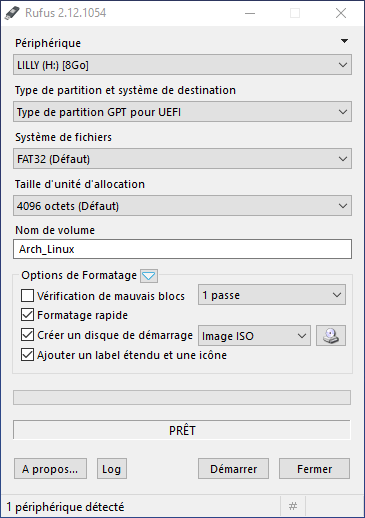

# Guide To installing Arch Linux in UEFI mode 64-bit along side Windows (November 2021)

**Important Disclaimer:** Read the entirety of the guide first before engaging in the installation process. Don’t skip any parts unless you know what you’re doing! If you have any questions, you are free to contact me. This is a beginner's guide so the purpose is to break down and explain each step in details so if you think this guide lacks information, feel free to write an issue to let me know.

## Part I: Is this the right guide for you? Let’s find out!

1- Use the Windows `key + R` keyboard shortcut to open the Run command, and then type `msinfo32`, and click the OK button to open System Information.


2- Under the "System Summary” section, find the BIOS Mode. If it says BIOS or Legacy, then **your Windows is installed in legacy mode** If it reads UEFI, then **your Windows is installed in UEFI mode**.

### Case 1: Legacy mode


The Windows in this example is running on Legacy. If this is also the case for you, then unfortunately this guide is not the right one for you. [You might want to check out this one instead]().

### Case 2: UEFI mode


The Windows in this example 10 is running on UEFI.
On the same menu, make sure that under “System Type”, it says that your device is x64-based.


If that’s the case, then you have found the right guide. Hop right on!

## Part II: Making a bootable device for Arch Linux:

To complete this step, you need to have on your possession a USB flash drive with at least 2 Gb of storage and one of these automatic tools installed on your windows device : Rufus, win32diskimager. These tools have a nice interface and they’re easy to easy to use. If you already know how to make a bootable device then you can skip this step. In my case, I am using Rufus so install this tool if you want to follow along.

**Important Disclaimer:** all data will be overwritten from that USB drive so make sure you back up all of your important data by copying it to another device.

1- Go to the official Arch Linux download page (https://www.archlinux.org/download/) to acquire the latest ISO file. You can download the ISO using any download medium you want but I highly recommend using the BitTorrent download if you don’t know what you’re doing or if you don’t have a stable internet.


_PS: You will need a torrent client installed on your device if you chose the BitTorrent Download method. I recommend you use qBittorrent if you haven’t already found your favorite._

2- After the ISO is downloaded, insert the USB flash drive and launch Rufus. It will detect the drive almost immediately. Since Rufus can handle various partition schemes and file structures, ensure that the correct settings are set that match the ISO you're going to build. It is important to note that you must choose the right flash drive otherwise you can damage your hard drive.

Since our ISO targets the UEFI system type, we need to set the “Partition scheme and target system type” to “GPT partition scheme for UEFI” and leave everything else to its default setting. Make sure you have the same settings as shown in the image below.



3- Click the optical drive button next to the "Create a bootable disk using checkbox", and you'll be prompted to search for the ISO image to use. Navigate to where your Arch Linux ISO has been downloaded and click “Open”.


When using ISO images, Rufus will automatically modify the settings to best match it. Make sure that “Partition scheme and target system type” is still set to “GPT partition scheme for UEFI”. Once everything is set correctly, click the Start button to begin the process. You'll be prompted with a warning that all data on the USB drive will be destroyed. Click OK to proceed with the creation process. Depending on the ISO image size, the process may take several minutes to complete.

4- When complete, double-check the external drive to verify the files were copied over.

## Part III: Freeing Space for Arch Linux:

We need to shrink one of your existing partitions to free some space for Arch Linux.

1- Press `Win+R` and type `diskmgmt.msc` and hit enter.

We want to shrink one of the partitions (choose a partition that ISN’T EFI or any other logical or system partition (C or D or F, whichever one that has enough free space)

2- Select a partition to shrink, right click it and click on “Shrink Volume”

3- Enter the amount of space to shrink (in MB! Refer to an online convertor if you're not sure how to convert). The amount of space you enter is the amount of space you’re going to free from the partition.


In my case, I want to free 200 Gb for the Arch Linux installation. The equivalent to that in Mb is “204800”. So that’s the amount I’m going to enter in the prompt.


4- When you’re done, click Shrink and exit the window when the Unallocated Space appears.

**Important Disclaimer:** Do not create a new partition out of the freed space now since we’re gonna do that during the installation process.

5- Attach your Arch Linux bootable device to your computer

6- We want to shut down windows after disabling fast shutdown. To do that, press `Win+R` and type `cmd` then enter. Type `shutdown -s -t 0` in the command prompt and click enter. Your computer will shut down soon after.

## Part IV: Booting into Arch Linux Installation Media in UEFI Mode

For security reasons, UEFI, which is enabled by default, only runs signed bootloaders. Therefore, it is not possible to start the computer from a CD or USB drive, unless the option is disabled so follow the instructions that best suit your case.

### Step 2: Secure boot enabled (You can ignore if yours is disabled)

We want to access BIOS settings to disable secure boot in order to allow our device to boot from our installation media.

1- Immediately after your PC powers up, and as soon as the manufacturer logo shows up on your BIOS splash screen, you will have the option of pressing a special key. This key changes from PC to PC, it all depends on your PC’s make and model. Typically, you will see a brief note at the bottom or top of the screen indicating what the key is. One such screen is visible to the right, note the legend in the top-right corner indicating F2 will start the BIOS setup and F12 will present the boot selection menu.

2- Go to Boot Manager and disable the option Secure Boot.


4- Save the changes and reboot.

### Step 2: Secure boot disabled

Just like in the first case, after your PC powers up and when you can finally see you manufacturer logo show up on your BIOS splash screen, press the special key to access your boot menu options. This key, just like the BIOS settings key, changes from PC to PC. Typically, you will see a brief note at the bottom or top of the screen indicating what the key is.

_PS: Some common options include the F2, F8, F12, and Del keys. You can also google how to access "bios settings/boot menu options" for your specific PC model._

## Part V: Installing Arch Linux

1- We want to create the swap partition first by entering:
`gdisk dev/sda`

```
#Command (? For help):  N (To exit help menu)
#Partition Number: (Hit enter)
#First Sector: (Hit enter, automatically first sector will be starting of unallocated space)
#Last Sector: +2GB (To specify the size of the swap partition)
#Hex code or GUID: 8200 (Indicating that the hex code for swap partitions is 8200 )
#Do you want to proceed? (Y/N):  Y (To write changes to disk)
#Command (? For help): W (To confirm changes)
```

2- Let us find out the partition number of the new Linux Swap Partition by typing:
`gdisk -l /dev/sda`

_PS: In my case, it is 6. So, I’m going to use sda6 to refer to the swap partition for the rest of the tutorial, but you should change it to the number of YOUR swap partition._

3- Let us format the label of the swap partition to “Linux Swap” by typing:
`mkswap -L "Linux Swap" /dev/sda6 `

4- Let us turn on the swap by typing:
`swapon /dev/sda6`

We can verify if the swap space has been turned on or not with: `free -m`

5- Time to create the root partition (in which Arch will be installed) by typing:
`gdisk /dev/sda`

```
#Command (? For help):  N (To exit)
#Partition Number: (Hit enter if you don’t care about the partition number)
#First Sector: (Hit enter, automatically first sector will be starting of unallocated space)
#Last Sector: (Hit enter, the rest of the unallocated space will be automatically occupied by the root partition)
#Hex code or GUID: (Hit enter, the default hex code for linux partitions will be automatically entered)
#Do you want to proceed? (Y/N):  Y (To write changes to disk)
#Command (? For help): W (To confirm changes)
```

6- Let us find out the partition number of the root partition by typing:
`gdisk -l /dev/sda`

_PS: In my case, it is 7. So, I’m going to use sda7 to refer to the root partition for the rest of the tutorial, but you should change it to the number of YOUR root partition._

7- Let us format the label of the root partition to an ext4 filesystem labeled “Arch Linux” by typing:
`mkfs.ext4 -L "Arch Linux" /dev/sda7`

_PS: If you're getting "the file /dev/sda(partition number) does not exist and no size was specified" error while you're formatting the root partition, then type "partprobe -s /dev/sda" then try again._

8- Mount the newly created partition to /mnt with:
`mount /dev/sda7 /mnt`

9- We need to initialize the Arch Installation (installing the base system) using pacstrap:
`pacstrap /mnt base linux linux-firmware`

\*PS: If you are using a wireless connection, you need to connect to your network using `iwctl` before attempting to install the base system as you will need internet to fetch the required packages. In order to do that, enter: `iwctl`.

Enter `ping archlinux.org` to check if your internet connection is working.\*

10- We want to mount the EFI partition to the directory /mnt/boot/efi. Type the following to create the directory:
`mkdir -p /mnt/boot/efi`

11- We need to figure out the partition number of the existing EFI partition by entering:
`gdisk -l dev/sda`

_PS: In my case, it is 2. So, I’m going to use sda2 to refer to the EFI partition for the rest of the tutorial, but you should change it to the number of YOUR EFI partition._

12- We now can mount the efi partition by typing:
`mount /dev/sda2 /mnt/boot/efi`

13- Generate the fstab, so that the necessary partitions are mounted on reboot.
`genfstab -u /mnt >> /mnt/etc/fstab`

14- Let’s chroot into the arch installation with:
`arch-chroot /mnt`

_The chroot Linux utility can modify the working root directory for a process, limiting access to the rest of the file system._

15- Configuring the time zone:
`ln -sf /usr/share/zoneinfo/Europe/London /etc/localtime`

16- Configuring the localization
`nano /etc/locale.gen`

- Scroll down and uncomment the needed locales. For reference, I uncommented `en_US.UTF-8`,  `fr_FR.UTF-8` and `ar_DZ.UTF-8`
- Press `CTRL+X`
- Enter `Y` to write out the changes

Now we should be able to generate the locales by entering:
`local-gen`

Create the `locale.conf` file in the directory `/etc/` by entering:
`nano /etc/locale.conf`

Enter the following entry in the file:
`LANG=en_US.UTF-8 `

_PS: Feel free to change this to your preferred default keyboard layout from the locales that you have previously uncommented. For me it’s english._

- Press `CTRL+X`
- Enter `Y` to write out the changes

Let's Make the changes persistent in vconsole.conf by typing:
`nano /etc/vconsole.conf`

Enter the following entry in the file:
`KEYMAP=us`

- Press `CTRL+X`
- Enter `Y` to write out the changes

17- Creating a hostname with:
`echo jobs >> etc/hostname`

_PS: Feel free to change "jobs" to whiever hostname you want._

18- Generate initial RAM disk by creating a new initramf:
`mkinitcpio -p`

19- Change the password for root user with:
`passwd root`

Enter your preferred password for the root user (the input is invisible by default).

20- Let’s install the bootloader. In this guide, we’ll be installing Grub since it’s the one I’m the most familiar with. Type:
`pacman -S grub efibootmgr`

21- Let’s generate the initial grub config
`grub-mkconfig -o /boot/grub/grub.cfg`

_PS: If you're getting the error `/boot/grub/grub.cfg no such file or directory`, you should create the directory by typing `mkdir /boot/grub` then try to generate the initial grub config again._

22- Grub has been configured, now time to install it in the HDD with:
`grub-install /dev/sda`

We can confirm that grub has indeed been installed by typing: `ls -l /boot/efi/EFI/arch`

23- Let’s create a new user labeled “lilly” and add them to the group wheel by entering:

`useradd -G wheel -s /bin/bash -m -c "Lilia Mehamli" lilly`

_PS: In this example, “Lilia Mehamli” is the name I chose and “lilly” the username. Feel free to label them however you want._

24- Let us give them a new password:
`passwd lilly`

25- Let’s install some desktop environments:

Let's install sudo with
`sudo pacman -S sudo`

I prefer using vim as a text editor but feel free to skip this part if you're comfortable with nano.
`sudo pacman -S vim`

I’m installing Gnome Desktop (you can change it to your favorite desktop/window manager)
`sudo pacman -S gnome-desktop`

II'm also installing Gnome Desktop Manager
`sudo pacman -S gdm`

Necessary tools to connect to the internet

```
sudo pacman -S iw wpa_supplicant dialog wpa_actiond
sudo pacman -S wireless_tools networkmanager network-manager-applet gnome-keyring
```

26- Configuring NetworkManager.service, wpa_supplicant.service and gdm (Gnome Desktop Manager) to start at next reboot with

```
systemctl enable NetworkManager.service
systemctl enable wpa_supplicant.service
systemctl enable gdm
```

_PS: Do not skip the installation of iw, wpa_supplicant and dialog. I skipped this part during my first installation and when I booted into my proudly and freshly installed Arch Linux I found out that I couldn’t connect to the WI-FI…_

26- Exit from chroot and manually unmount all the partitions with:

```
exit
umount -R /mnt
```

27- Reboot into Arch Linux using:
`reboot`

## Part VI: Regenerating Grub Configuration

1- Enter your user’s password to access an arch session.
2- Open the terminal
3- Let’s install os-prober in order to find the Windows Boot Manager with the command:
`sudo pacman -S os-prober`
4- Let’s regenerate grub config with the command:
`sudo grub-mkconfig o /boot/grub/grub.cfg`

If you get the warning `os-prober will not be executed to detect other bootable partitions` then please follow [this guide](https://www.youtube.com/watch?v=6z2Il-jVKqA)!

5- Once all of that finished, let’s reboot into grub with the command:
`reboot`

Done! Now you can choose between Windows and Arch Linux with the grub menu.

**Important Disclaimer:** Remember NOT to enable secure boot again if you want to keep the dual boot interface, or else you'll have to boot every time into windows/arch manually using the BIOS or Boot menu options instead of the grub menu.

## Do you have an ACER laptop?

Refer to [this post-installation](/ACER.md) guide after your installation!
