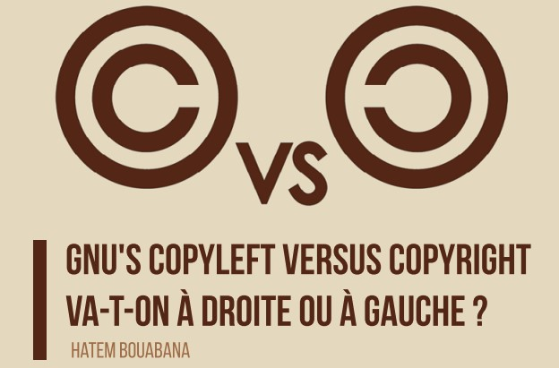
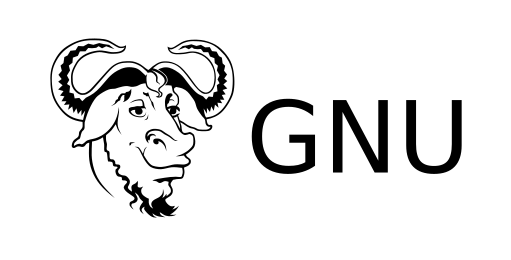

# GNU's Copyleft versus Copyright: Are We Going Right or Left?

*this article was originally written in french on the 01 April 2014, you can read ! the original version here : https://wiki.openmindsclub.net/posts/copyleft-vs-copyright/*

## First, What Is Copyleft?

Copyleft is a general permission to make a program (or any other work) free and to require that all modified versions of that program be free as well. The simplest way to make a program free is to place it in the public domain, without copyright (copyright being a form of author's right that does not allow a work to be placed in the public domain). This allows people to share it along with their potential improvements. However, it also allows others to turn it into proprietary, non-free software. These individuals can make changes and distribute the result as proprietary software. Those who receive the program in its modified form will not have the freedom the original author intended; the intermediary will have taken that away.

## What About GNU?

The goal of the GNU project is to give all users the freedom to redistribute and modify GNU software. Intermediaries could otherwise strip the software of its freedom, leaving end users without any freedom. So, instead of placing GNU software in the public domain, it was published under "copyleft" (also known as "left of the author"). Copyleft states that anyone redistributing the software, with or without modifications, must also ensure the freedom to copy and modify it. Copyleft ensures this freedom for all users.

## But Is It Really Useful?

Consider GNU C++. Why does a free C++ compiler exist? Solely because the GNU GPL stipulated that it must be free. MCC, an industrial consortium, developed GNU C++ based on the GNU C compiler. MCC would have preferred to make this program as proprietary as possible. However, they were required to release it with a free C++ interface because that was the only option provided by the GNU GPL (GNU General Public License). The C++ interface involved many new files, but because these files were linked to GCC, the GPL applied to them. The benefit to the free software community is clear.

Proprietary software developers use copyright to restrict users' freedom; the GNU project uses copyleft to guarantee it. This is why they coined the term "copyleft," replacing "copyright" with it.

An alternative form of copyleft, the GNU Affero General Public License, applies to programs that can be used on servers. It ensures that modified versions used to implement publicly available services will be released as source code.

The GNU Free Documentation License is a form of copyleft for manuals, books, and other documents, ensuring everyone the effective freedom to copy and redistribute them, with or without modifications, for commercial or non-commercial purposes.

## Right and Left...

Copyleft is a way to use copyright, not to abandon it; in fact, doing so would make copyleft impossible because to make a work copyleft, you must be the author and thus possess rights (copyright). The "left" in "copyleft" is not a reference to the verb "to leave." It is merely a reference to the opposite direction of "right."

## References 
[https://www.gnu.org/copyleft/](https://www.gnu.org/copyleft/)  
[https://copyleft.org/](https://copyleft.org/)  
[https://fr.wikipedia.org/wiki/Copyleft](https://fr.wikipedia.org/wiki/Copyleft)