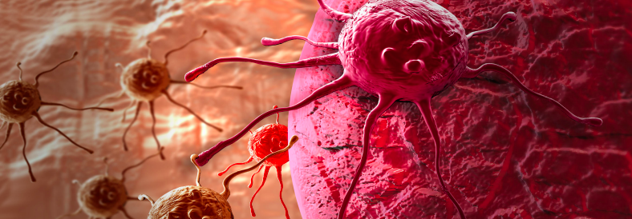
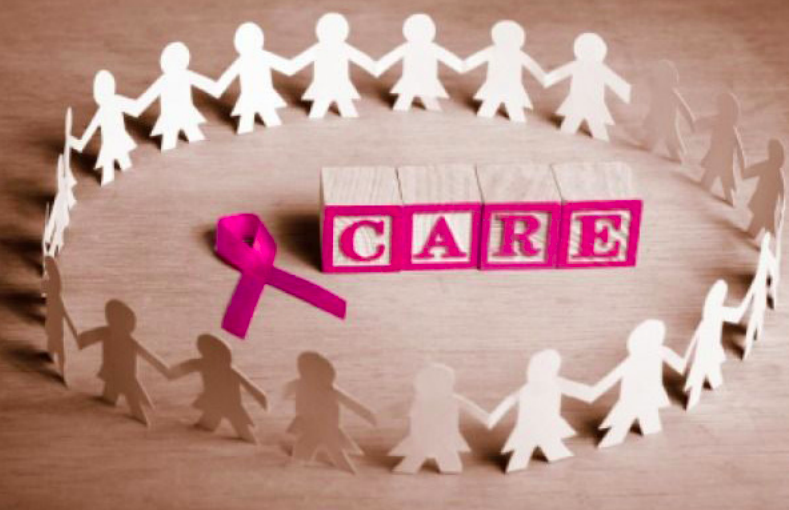
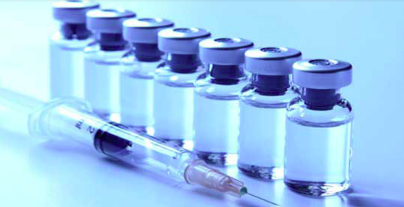

# Breast Cancer

In our society, certain issues are weirdly interpreted, especially when it comes to some dangerous diseases, the insouciant gives general knowledge but sceptics. For many, the only thing that they would be focusing on is that it is something horrific and talking about it will increase their chances to have it. Therefore, they prefer not to bring it up. In this field there was several researches, first we must know what is breast cancer? Like any cancer in general, it develops from the body cells (breast cells) and generates a tumor, cancer cells multiply uncontrollably, and there are too many cells than the number needed. The tumor usually starts in the inner lining of milk ducts (tubes) or the lobules - tiny glands that produce milk - that supply them with milk. The tumor could be malignant tumor, which can spread to other parts of the body causing other types of cancer (invasive).

## What is the difference between invasive and non-invasive breast cancer?

### **Invasive breast cancer - cancer**

cells get out from inside the lobules or ducts and invade nearby tissues reaching the lymph nodes, and eventually make their way to other organs, such as bones, liver or lungs. The cells can travel through the bloodstream or the lymphatic system to other parts of the body.

### **Non-invasive breast cancer - cancer cells stay still in their origin place.**

Sometimes, this type of breast cancer is called “pre-cancerous”; which means that although cells have not spread into the body, eventually it could develop invasive breast cancer. What causes breast cancer? Many factors can develop it in both sexes male and female since boys and girls, men and women all have breast tissues. The vast majority of the cases occur in females. Even though experts are not entirely sure what could cause it in female rang, we can present some general causes which do,

- Getting older.
- Genetics, if the family have a breast cancer member others are more likely to develop breast cancer. (Breast cancer inherited cases are due to the presence of two abnormal genes: BRCA1 and BRCA2 (BReast CAncer gene one and two). Genes are found in the DNA, which carries genetic information of both healthy, and cancer cells. Cell’s DNA can be damaged spontaneously or from an exposure to specific things in the environment. In addition, cells are like debuggers that detect and repair DNA damage. If a healthy cell’s DNA is damaged and could not be fixed, the cell turns into a cancerous cell. Abnormal BRCA1 and BRCA2 increase the risk of breast and other cancers, because they affect cells’ ability to repair damaged DNA).
- A history of breast cancer, if a female has had breast cancer, even non-invasive cancer, is more likely to develop the disease again.
- Estrogen exposure, if a female started having periods earlier or entered menopause later than usual has a higher risk of developing breast cancer.
- Obesity, post-menopausal obese and overweight women are in a higher risk of developing breast cancer. Since there are higher levels of estrogen in obese menopausal women.
- Exposure to some chemicals may increase the risk of breast cancer.
- Birth control pills, a new study suggests that this increased risk may only apply to recent users and is dependent on the content of the pill. Factors for Male Breast Cancer (male breast cancer is not uncommon and must be taken seriously), sometimes men can develop real breast gland tissue by taking certain medicines or having higher estrogen hormone levels. A male can get it by,
- Growing older, just as the case is for women.
- High estrogen levels, taking hormonal medicines, being overweight, having liver disease ... stimulates the presence of estrogen.
- Klinefelter syndrome, increases estrogen levels. Normally men have a single X and single Y chromosome. Men with Klinefelter syndrome have more than one X chromosome (sometimes as many as four).
- A strong family history of breast cancer or genetic, partic ularly if other men in the family have had breast cancer or if it has been proven that breast cancer gene abnormality is in the family.
- Radiation exposure, having chest radiation therapy and particularly during adolescence. Recent developments on breast cancer treatments Breast Cancer Vaccine Shows Promise in Early Trial” By Alan Mozes, published on TUESDAY, December 2nd, 2014 (HealthDay News), in its early trials the vaccine showed an immune response and in 50% of the cases there were no signs of cancer progression also the side effects were minimal after one year. But the study needs more tests and a final confirmation.
