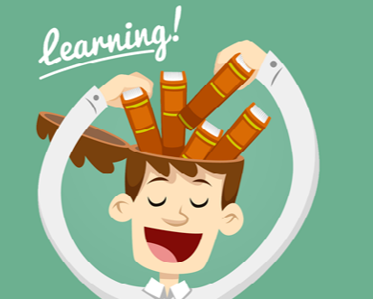
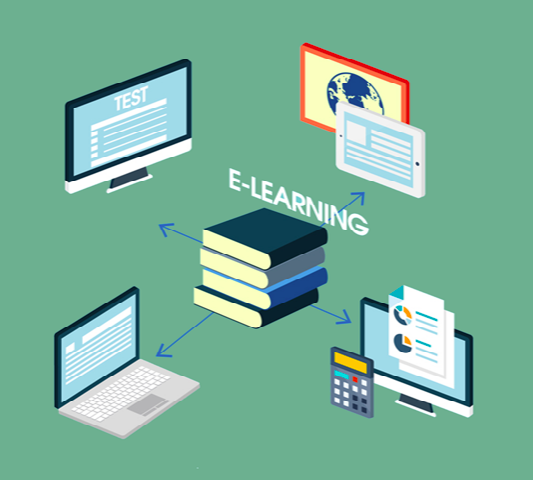

# What About Learning It By Yourself?

Does this question come to your mind every time ? Yes ? No? There are two types of people. First, those who can learn something new by themselves using different resources (books and Internet) but it takes a long time. The others, pay money to
accelerate the process. If we look closely we notice that both of them have pros and cons, learning by yourself means looking for tutorials and books through the Internet, libraries or even buying them costs you too much time and effort to master a new skill, instead of taking direct information and instructions from a professional who gives you the main basics and guides you through the session.

For example, to master softwares as Blender and Autocad, writing softwares as Libre Office (GNU/Linux) or Microsoft Office (Windows) you have to pay an average of +20000DZD to gain the certificate that allows you to add it to your CV, but what
about simple students, people, and anyone who can't afford to pay that amount of money ?!

Of course the Internet is a big world full of information and courses to learn or teach for free ! Yes for free !!

Many years ago information was limited to encyclopedias and dictionaries in libraries, Today we have the mother of communication as we call it : INTERNET . Today we can download an e-book or search for anything in seconds, all you need is a computer, a smart-phone or even a tablet to start LEARNING. But wait ! What is learning ? We talked too much about it but we don't even know what the real meaning of “learning” is.
To learn is “The knowledge or skill gained through schooling or studying”, eventually my version is “Be pretty good at something new through studying” , the problem of learning is how it is done, few people really know how it is done, you should be one of them! The artof AUTO-LEARNING In order to begin, ask yourself “How long will it take me to acquire the new skill? Some people say you need more than 9000 hours to do it ! But the truth is you need the basics and lots of practice to achieve your goal. Let's get started. Here’s some advice :

## 1- Motivation

Before you start any project, always ask yourself three questions: Why am I doing it, what the results might be? And will I be successful? Motivation is the key of our topic, motivation is the food of the performance, if you want something deeply JUST DO IT, motivation increases the amount of effort and energy that learners spend in activities, it is the main difference between them and the society.

So if you want to be motivated , all you need is to set your goal to accomplish it by loving it.

## 2- Resources

As we said before, we have the INTERNET that is full of information and help for self learners, education in these days is different than before, many universities and schools are providing course materials online.

The goal of as called as “virtual education “ is to expand access for the educational resources for all who wish to learn. For example, one day the students of MIT (Massachusetts Institute of Technology) had the incredible idea to record their courses and publish them on the WEB for free, now it is called OpenCourseWare project (OCW), you just need to subscribe on their website www.ocw.mit.edu. Here are some of the most famous online platforms providing free courses, on about every subject you can think of:

- https://www.coursera.org
- https://www.ed.ted.com
- https://www.openclassrooms.com (FR)
- https://www.khanacademy.org
- https://www.edx.org
- https://www.lynda.com

## 3- Getting Started

After preparing all the lessons that you need, start learning with idea that you are going to have a lot fun doing it, begin picking the basics, they are the first tools you need in your project.

## 4- Practice Time

To make learning interesting, with the minimum that you get from the first lessons, try putting what you gained into practice, in order to remember the techniques, more and more you'll get the experience.

## 5- No Social Media

Distraction is the 1st enemy, close all the tabs of Facebook, Twitter ...etc. Your learning time is special, losing focus is painful and costs additional time.

## 6- Keywords

When you don't understand something, look it up using web search engines or forums.

## 7- Challenges

Try to find people who share the same interest as yours, then, make some challenges, your new skills will be tested, you'll find the missing parts that you skipped to correct them. So, this is my personal advise that I commit to when I want to acquire a new knowledge by myself. Unfortunately, self-learning doesn't give certificates but it gives you a huge amount of information, to evolve into an experienced and skillful person.
