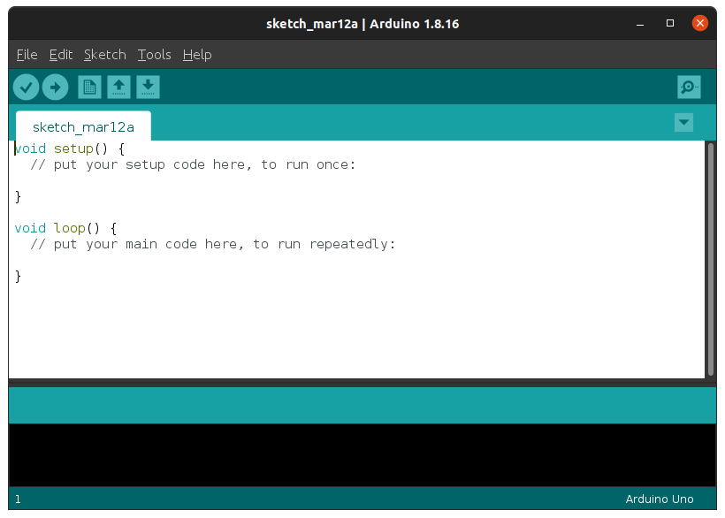
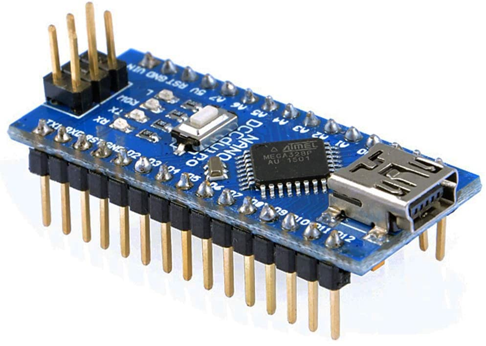

# TUTO SUR ARDUINO

    Ce  tutoriel est une introduction à l'électronique embarquée ,un domaine mettant à contribution  
    l'électronique ainsi que llnformatique et qui utilise la technologie Arduino.

## Mais avant de commencer, qu’est ce que l'électronique embarquée ou encore Arduino ?

En faisant une petite recherche sur internet nous pouvons Lomber sur plusieurs définitions,parmi lesquelles: ***“Un système embarqué est un système autonome basé sur l'électronique et l'informatique à la fois dans le temps réel“***.

Les système embarqué utilise en général des microprocesseurs ou des microcontrôleurs (comme 
Arduino, PIC ...etc.).

Certains diront qu’Arduino est donc un microcontrôleur ; en réalité une carte Arduino n'est pas un microcontrôleur mais son composant essentiel en est un.

Arduino est le fruit du projet de six développeurs : Massimo Banzi, David Cuartielles,Tom Igoe, Gianluca Martino, David Mellis et Nicholas Zambetti. Cette équipe a crée le système Arduino.

Le système Arduino, nous donne la possibilité  d'allier  les  performances de la  programmation  à  celles  de l'électronique, il nous permet donc de programmer les systèmes électroniques.
il nous permet donc de programmer les systèmes électroniques. Je vous laisse imaginer le nombre 
infini d'applications, par exemple :
- Télécommander un appareil mobile (modélisme).
- Fabriquer des robots.
- Communiquer avec un ordinateur.

Pour utiliser la technologie Arduino nous aurons besoin de la carte électronique et du logiciel Arduino.

Le système Arduino est libre: en d'autre termes n'importe qui peut avoir accès à son code source (Open Source) et les schémas des cartes se trouvent sur internet pour les gens qui veulent réaliser leur propre carte (Open Hardware).

Cette liberté a une condition : le nom « Arduino » ne doit être employé que pour les cartes « officielles ». En somme, vous ne pouvez pas fabriquer votre propre carte sur le modèle Arduino et lui assigner le nom « Arduino »

Ce qui nous donne trois type de cartes:
- Officielle : Fabriquée en Italie par la société Smart Project.
- Compatible : qui ne sont pas fabriquées en Italie mais sont compatibles avec les cartes officielles

Les autres fabriquées par diverses sociétés et commercialisées sous des noms différents (Freeduino ..)

Nous allons nous intéresser aux cartes officielles uniquement et dans cette catégorie nous trouvons différentes cartes. La carte Uno que nous allons utiliser dans ce tutoriel :
- **La carte Arduino Uno** est plus grande que la première, a un nombre de pins (ports) plus im- portant 
et possède plus de liaisons série. La carte Arduino Méga classique est la plus connue et la Méga 
256 mais ily a aussi la Méga ADK qui a une inter- face USB pour la connecter avec les systèmes 
Android.

- **La carte Arduino Méga** est plus grande que la première, a un nombre de pins (ports) plus important 
et possède plus de liaisons série. La carte Arduino Méga classique est la plus connue et la 
Méga 256 mais il y a aussi la Méga ADK qui a une interface USB pour la connecter avec les sys- 
tèmes Android.

- **La carte Arduino Nano** C'est ma carte préférée puisqu'elle est de petite taille donc parfaite pour la réalisation de  systèmes  embarqués  et  elle s'adapte bien aux cartes sans soudure (plaques d'essai).

