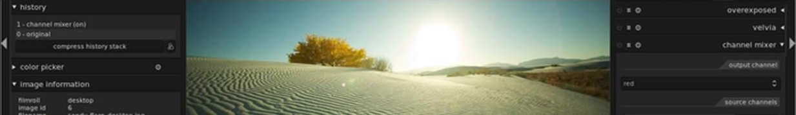

# Darktable

Une alternative libre pour les photographes

[**Darktable**](https://www.darktable.org/) est un logiciel de traitement photographique sous license [GPLv3](https://www.gnu.org/licenses/gpl-3.0.en.html). Il permet la gestion des photos dans une bibliothèque «*Lighttable*» ainsi que le traitement du format RAW «*Darkroom*» de manière non destructive.

## Installation

Comme un tas de logiciels sous Linux, il suffit de taper une seule commande pour lancer son installation `sudo apt-get install darktable`. Après la fin de l'installation, tapez `darktable` dans votre terminal pour l'exécuter.

Une fois overt, l'interface utilisateur est très fluide et assez simple d'utilisation. De plus elle ressemble étrangement à celle de Adobe Lightroom 5, les utilisateurs de ce dernier ne seront pas déboussolés.

## Onlgets

**Darktable** est principalement constitué de 5 onglets ou modes. Un simple clic sur les onglets en haut à droite vous permettre de switcher entre eux.

#### Lighttable
Le premier onglet est le «*Lighttable*»: C'est l'onglet où sont indexé toutes les photos que vous ave importées sous **Darktable**. C'est aussi l'endroit où vous pourrez regarder, noter, épingler et taguer vos photos. Les EXIFs de chaque photo apparaîtront dans le panneau Image Information en bas à gauche.

* Commençons par l'outil «crop and rotate» qui permet de recadrer votre photo selon des cadrages prédéfinis (`5:7` / `3:4` / `16:9` ...) ou d'arranger l'angle de l'image d'une manière autosomique ou manuelle.

#### Darkroom

Le deuxième onglet, «*Darkroom*» présente l'interface que vous aurez à utiliser le plus souvent. Et oui c'est ici que vous trouverez la plupart des modules de development dont vous aurez besoin, si ce n'est plus. Ces derniers sont triés d'une manière assez simple et intuitive, rien de plus facile.

* La «*White Balance*» (Balance des blancs) est l'un des modules les plus importants. En effet, c'est l'un des premiers paramètres à équilibrer pour avoirs un meilleur rendu des couleurs.
	
* Le module «*Shadows and highlights*» permet d'ajuster la tonalité des zones sombres (les ombres) ainsi que des hautes-lumières (Highlights). Vous aurez à utiliser ce module plus fréquemment que vous ne le pensez afin d'équilibrer les lumières dans votre photo.
	
* Le module «Exposure» ou exposition va vous permettre de correctement exposer votre photo vous pourrez utiliser des filtres afin d'exposer une partie de l'image seulement. Activer le mode «*Auto*» va vous simplifier cette tâche, vous n'aurez qu'à sélectionner "à bien exposer" et Darkroom s'occupera du reste.
	
* Le mode «*Contrast Saturation*» permet d'ajouter un peu de contraste à votre photo. L'outil saturation permet de renforcer le rendu des couleurs. Ces deux outils sont essentiels pour embellir et donner vie à votre photo.
	
* Nous citerons aussi le module «*Lens correction*» ou Correction de l'objectif. Ce module corrige les distorsions et vignetages de l'objectif.

#### Tethering

 Le troisième mode, «*Tethering*» vous permet de contrôler votre APN à partir de **Darktable**. Vous pourrez ainsi shooter plus facilement depuis votre PC, et les uploader pour le post-traitement sur Darkroom.

### Map
 Le quatrième mode c'est le «*Map*». Un onglet assez intéressant qui vous permet de visualiser une carte contenant plein de photos géo-taguées. Vous pourrez uploader vos propres photo et les géo-taguer. Une bonne initiative vers l'OPENPHOTO.

#### Slideshow

Le cinquième mode «*Slideshow*». Comme son nom l’indique c'est un mode qui vous permet de visualiser vos photos dans un diaporama. Il est conseillé de mettre **Darktable** en mode plein écran en appuyant sur <kbd>F11</kbd> afin d'apprécier cette expérience.

---

**Darktable** n'a donc rien à envier à ses concurrents. Par ailleurs, il est Libre, open source et totalement gratuit. Vous ne pourrez qu'apprécier la diversité des modules de retouche disponible.