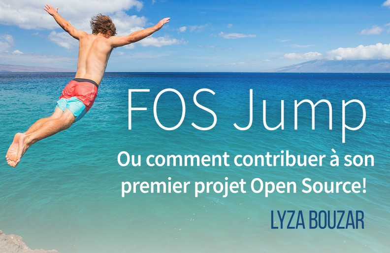

# FOS Jump   Ou comment contribuer à son premier projetOpen Source!

Les logiciels open source ou free software sont des logiciels qui se caractérisent par la possibilité d'accès à leurs codes sources. Ils sont accessibles à qui veut les voir et peuvent être modifiés. Plusieurs utilisateurs de ces logiciels ont des idées de modifications mais ne savent pas comment les proposer ou les concrétiser. C'est dans le but d'aider ces personnes-là que Samy Melaine, ancien président du club et informaticien, a eu l'idée de créer son site web nommé « **FOS jump** » (Free Open Source Jump) qui regroupe différents liens menant vers des projets en cours, des tutoriels etc..

Afin de sensibiliserles gens à l'esprit du libre et de leur communiquer sa passion, Mr Melaine a tenu le 25 avril une conférence « **Open Science** » à l'AUF de Bab Ezzouar, où il a parlé des différents domaines qui sont actuellement touchés par «l'open». Il a notamment cité l’« **Open Source Drug Discovery**» qui rassemble des scientifiques du monde entier et qui les sponsorise pour booster l'avancée de la recherche dans le domaine pharmaceutique. Cette initiative a permis de sauver la vie de milliers de personnes. Il a aussi parlé de l’« **Open Health Care** » pour la médecine et l’« **Open Hardware** » pour l’électronique.

Suivant cette conférence s’est tenue une session Q&A, plusieurs questions ont été posées parmi lesquelles : « Pourquoi devrait-on abandonner Windows pour Linux » et « Peut-on gagner de l'argent avec les free software ? ». Mr Melaine et d'anciens membres du club ont été clairs dans leur réponses en expliquant que leur but n'était pas de forcer les gens à quitter Windows mais seulement de leur faire prendre conscience des risques qu'ils prennent inconsciemment en l'utilisant, car tout ce qu'on partage sur les logiciels Closed Source ne nous appartient plus. Et pour la question d'argent, « free » pour « free software » veut dire libre et non pas gratuit.

La théorie étant insuffisante, Mr Melaine nous a invité à prendre part à un atelier pratique dans lequel il nous a appris comment contribuer à un projet Open Source. Les démarches à suivre sont simples : Vous devez tout d'abord installer Git sur votre PC, ensuite créer votre propre compte GitHub. Une fois que vous avez votre propre compte vous pourrez participer à des projets open source auxquels vous aurez accès grâce à FOS Jump.

Une idée reçue circule sur le fait que seuls des informaticiens ont la possibilité de contribuer au free software. Ceci n'est pas vrai car il existe plusieurs moyens d'y participer tels que la traduction de logiciels.

Samy Melaine et d'autres membres d'Open Minds club seront ravis de répondre à vos questions et vous aideront à sauter le pas et à plonger dans le monde de l'Open Source.

Pour participer au projet,rendez-vous surle lien : [fosjump.github.io](https://fosjump.github.io/)
