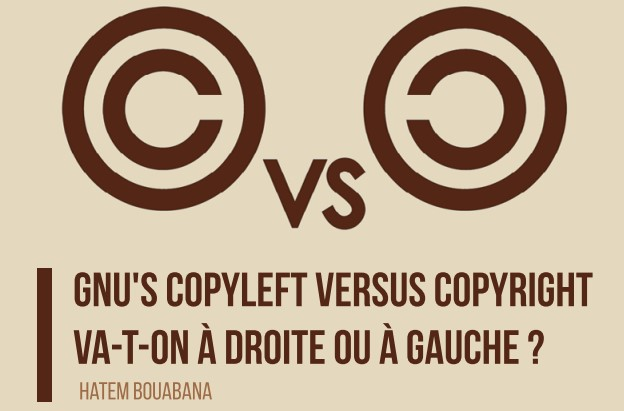
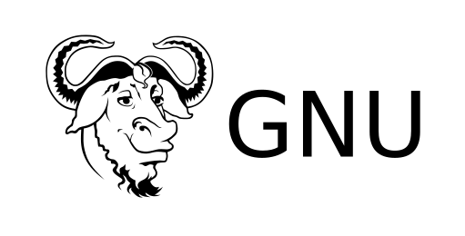

# GNU's Copyleft versus copyright Va-t-on à droite ou à gauche?

## Tout d'abord, qu'est un copyleft ?
Le copyleft est une autorisation générale pour rendre libre un programme (ou toute autre œuvre) et obliger toutes les versions modifiées de ce programme à être libres également.
La manière la plus simple de faire d'un programme un logiciel libre est de le mettre dans le domaine public, sans copyright (Le copyright est une sorte de droit d'auteur qui ne permet pas de mettre une œuvre dans le domaine public). Cela autorise les gens à le partager avec leurs améliorations éventuelles. Cependant cela autorise aussi des personnes à en faire un logiciel privateur ou non libre. Ces personnes peuvent très bien y effectuer des change ments et distribuer le résultat en tant que logiciel privateur. Ceux qui recevront le programme dans sa forme modifiée n'auront pas la liberté que l'auteur original leur avait donnée ; l'intermédiaire l'aura fait disparaître.

## Et GNU dans tout ça ?
Le but du projet GNU, est de donner à tous les utilisateurs la liberté de redistribuer et de modifier les logiciels GNU. Des intermédiaires pourraient alors dépouiller les logiciels GNU de la liberté, les utilisateurs finaux se retrouveraient alors sans aucune liberté. Alors, au lieu de mettre les logiciels GNU dans le domaine public, Ils ont été publiés sous « copyleft » (appelé aussi « gauche d'auteur »). Le copyleft stipule que celui qui redistribue un logiciel, avec ou sans modification, doit aussi assurer la liberté de le copier et de le modifier. Le copyleft garantit cette liberté à tous les utilisateurs.

## Mais est-ce vraiment utile?
Considérons GNU C++. Pourquoi existe-t-il un compilateur C++ libre ? Uniquement parce que la GNU GPL indiquait qu'il devait être libre. MCC, un consortium industriel, a développé GNU C++ à partir du compilateur C de GNU. MCC aurait voulu rendre ce programme aussi privateur que possible. Cependant ils ont été obligés de le publier avec une interface C++ libre parce que c'était la seule possibilité que leur laissait la GNU GPL (GNU General Public Licence). L'interface C++ comportait beaucoup de nouveaux fichiers, mais comme ces fichiers étaient liés à GCC, la GPL s'appliquait à eux. Le bénéfice pour la communauté du libre est évidente.
Les développeurs de logiciels privateurs utilisent le copyright pour restreindre la liberté des utilisateurs ; le projet GNU utilise le copyleft pour la garantir. C'est pourquoi ils ont inversé le nom en remplaçant « copyright » par « copyleft ».

Une forme alternative de copyleft, la licence publique générale GNU Affero, s'applique aux programmes susceptibles d'être utilisés sur des serveurs. Elle garantit que les versions modifiées servant à implémenter des services mis à disposition du public seront publiées en tant que code source.

La licence GNU de documentation libre, est une forme de copyleft destinée aux manuels, livres et autres documents, qui assure à chacun la liberté effective de les copier et de les redistribuer, avec ou sans modifications, de façon commerciale ou non.

## A droite puis à gauche… 
Le copyleft est un moyen de se servir du copyright ce qui ne signifie pas abandonner le copyright ; en réalité, faire cela rendrait le copyleft impossible car pour rendre un logiciel sous autorisation copyleft vous devez en être l'auteur et donc en possession de droits (copyright). Le mot left dans « copyleft » n'est pas une référence au verbe to leave. C'est seulement une référence à la direction inverse de right.

### Références 
[https://www.gnu.org/copyleft/](https://www.gnu.org/copyleft/)  
[https://copyleft.org/](https://copyleft.org/)  
[https://fr.wikipedia.org/wiki/Copyleft](https://fr.wikipedia.org/wiki/Copyleft)
