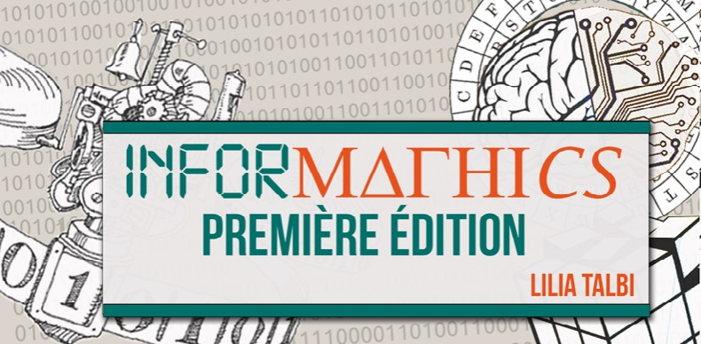
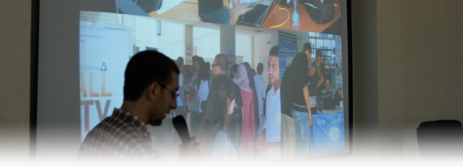
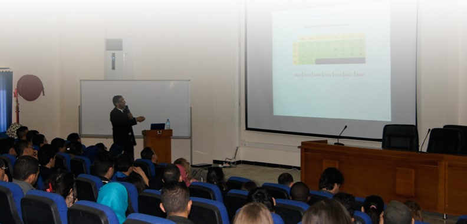
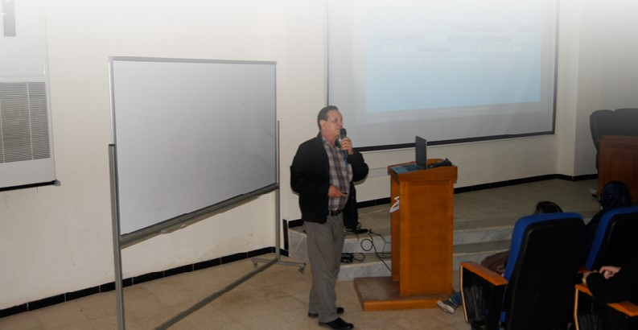

# Informathics : Première édition

Théorie des nombres, intelligence artificielle, stéganographie, ainsi que d’autres domaines déterminant le solide lien qui existe entre les mathématiques et l’informatique, furent au rendez-vous ce jeudi 14 Avril 2016 lors de la 1ére édition d’INFORMATHICS. Une journée dédiée à la science, organisé par l’équipe d’Open Minds Club, où se sont enchainées conférences et activités de cryptographie et d’énigmes à résoudre, visant à faire participer l’audience principalement composée d’étudiant de l’USTHB, enseignants mais aussi quelques visiteurs externes ayant eu vent de l’évènement.

Le Cyber Espace de l’USTHB a accueilli pour l’occasion plus de 200 personnes de tout âge, et de toute filière qui ont répondu à l’appel afin de découvrir un nouvel horizon et participer à la célébration. « Célébration d’un mariage heureux entre deux filières (mathématiques et informatique) qui promet de perpétuer» ainsi décrit le maître de cérémonie Nassim GUERROUMI, Vice-président du club, la relation de complémentarité qui subsiste jusqu’à ce jour entre ces deux mondes extrêmement vastes.

Après une présentation de l’évènement et de la philosophie du club par Samy MELAINE, ancien président du club, ce fut au tour de MR ZEKIRI, Mr BENMERAR, MR BOUROUBI, Mme MOKHTARI, Mme KHADIR, professeurs et doctorants au sein de l’USTHB, qui se sont succédés à la planche afin de présenter chacun leurs thèmes respectifs.

Le déroulement des conférences fut entrecoupé par des jeux et activités, notamment celui du fameux Rubik’s cube de Lyes HIBA afin que sa résolution ne soit plus un secret, mais également le jeu Crypteasy présenté par Imene BENZENACHE, qui consiste à décrypter une succession de lettres de manière à obtenir une phrase cachée à l’aide de la table de Vigenère pour enfin terminer avec la solution humaine et algorithmique d’une énigme préalablement proposée à l’audience exposée et expliquée par Racim BOUSSA.

## Comment les mathématiques nous ont appris à programmer

Les mathématiques, loin de se résumer à des calculs, représentent une manière de penser, une suite de raisonnements logiques permettant d'aboutir à une démonstration ou à la solution d'un problème donnée. Cette définition est souvent présente lorsqu'on parle d'algorithme en informatique, cela nous mène à penser à leur passé commun. Ce fut le thème de la conférence de **Mr Benmerar**, Doctorant et enseignant à l’USTHB dans le Cloud Computing et IRM De Dif fusion, qui présenta à l'auditoire un aperçu sur l’évolution des mathématiques modernes jusqu’à l’émanation de l’idée de la programmation et ce en passant par les notions de cohérence, complétude et décidabilité ainsi que le fonctionnement de la fameuse machine de Turing dont le fonctionnement a inspiré celui des ordinateurs actuels.

## Théorie des nombres: des mathématiques à la cryptographie

De tout temps, la Théorie des Nombres a été un sujet fascinant que ce soit à l’époque grecque, durant l’âge d’or de la civilisation de l’Islam ou encore à l’époque des « Riemann, Gauss, Hilbert, …etc… ».

Une caractéristique remarquable de la Théorie des nombres est la simplicité incroyable de l’énoncé de ses problèmes qui contraste avec les solutions de ces mêmes problèmes…quand ils trouvent des solutions. Nous pouvons citer, à titre d’exemples: Le Théorème de Fermat-Wiles, le Théorème de la Progression Arithmétique de Dirichlet ou encore le Postulat de Bertrand démontré en 1856 par Tchébycheff.

Lors de sa conférence, Mr Zekiri s’est employé à démystifier l’enseignement des Mathématiques en général et la Théorie des nombres en particulier et à pousser l’audience à développer un regard sur les mathématiques autre que celui les réduisant à de simples recettes et formules à appliquer, en exposant leur rôle important dans le développement de notre jugement, de notre esprit d’abstraction et de nos facultés de création et d’innovation.

## La stéganographie ou l’art de dissimuler des données

De par l’attrayante introduction de Mr Bouroubi, lors d’Informathics, la cryptologie et un sujet qui en passionne plus d’un. Mais aussi, qui d’entre nous n’a pas entendu parler du chiffre de césar ? Ou des anciens cahiers de notes de Léonardo de Vinci ? Avent d’être considéré comme une science, le concept de crypter des messages remonte à l’Antiquité. Il est né du besoin de communiquer en évitant qu’une tierce personne ne mette la main sur le contenu du message. «Ce domaine est stratégique pour les états qui se respectent, il faut qu’il trouve une communauté d’universitaires qui le développe» nous confie Mr Bouroubi,  Les clés pouvant être secrètes ou publiques, il existe plusieurs systèmes de cryptage qui s’imprègnent d’une logique mathématique tel que l’usage des statistiques et probabilités pour retrouver les codes de permutation de lettres et bien d’autres. La stéganographie est une branche de la cryptographie, elle ne chiffre pas les informations mais les dissimule plutôt, cela consiste à faire passer subtilement un message à travers une image ou un texte, ça peut être une autre image, des lettres, des nombres...

Sauriez-vous lire ce message ? Faite preuve d’astuce !

 QETSU TUDEA IPIOP CENU AQRU 

Source : Le grand livre des codes secrets David Cornélien Ed. MARABOUT.

## Connaissiez-vous le TAL?
Suivant les informations qu’il possède, l’Homme peut, dans un idiome qui lui est familier, comprendre une phrase et son contexte. Le Traitement Automatique du Langage (TAL), ambitionne de doter les machines de cette capacité afin de pouvoir organiserles données et faciliter les recherches thématique sur un réseau social, forum,…etc. Et ce en concevant des programmes capable d’analyser un support Oral (traitement de discours) ou écrit (traitement de texte). Pour cela il doit faire appel aux règles de la langue. Durant sa conférence, Mme KHADIR a non seulement expliqué le fonctionnement du TAL, mais elle a surtout mis l’accent sur les difficultés de cette discipline et les challenges auxquels elle doit faire face tels que l’ambiguïté d’un discours, car obtenir que la machine comprenne parfaitement le sens d’une parole ou d’un écrit relève de l’intelligence artificielle, qui elle-même confronte de nombreux hics.
Le TAL, en soit, est un sujet dérivé de l’intelligence artificielle, ils opèrent tous deux à attribuer à une machines des tâche jusque-là réservées à l’Homme

## «Intelligence artificielle»
Après le TAL, passons à présent à la modélisation des connaissances, Mme MOKHTARI nous a fait un tour d’horizon sur ses concepts et méthodes qui assurent l’avancée des recherches pour le développement de la machine au niveau intellectuel.
L'identification et la structuration des connaissances mais aussi des différents types de raisonnement sont devenus nécessaires, ainsi que la modélisation et l'implémentation, et cela représente le principal but du domaine de la modélisation des connaissances et raisonnement (RCR), dont les travaux se basent sur l’étude des modèles logiques, graphiques et comme l’a mentionné Mme Mokhtari sur les problématiques de l’inférence. Le processus se constitue d'une première étape de choix du langage de représentation pour exprimer les informations langages logiques ( proportionnelles , modaux …), d’informations quantitatives ( théorie des probabilité …). Le choix à faire est important pour obtenir les propriétés voulues en terme d’efficacité , causalité, et de complexité . Ensuite, il faut modéliser les différents types de raisonnement, autrement dit identifier leurs propriétés, afin de pouvoir concevoir des méthodes réalisant ces opérations correctement.

## «Les maths sont partout»

L’idée de cet évènement fut initialement proposée par **Sarah Benabidallah**, étudiante en première année, à l’USTHB, qui nous explique sa détermination « Fuir les maths est devenu une seconde nature chez l’étudiant n’ayant pas conscience du lien indéniable entre elles et l’informatique. Pour ce faire, j'ai essayé de choisir des sujets dans le domaine où les maths œuvrent de façon apparente. Les participants devraient à priori sortir avec l'idée que les mathématiques sont partout. Cette peur d’échouer en mathématiques est due à la difficulté de prouver, ce n'est pas quelque chose de naturel chez l'Humain, certains disent que ça ne sert à rien, mais c'est totalement faux. C'est une gymnastique cérébrale très dure que de comprendre un théorème et pourtant certains d'entre nous trouvent de la beauté dans les mathématiques. Chose que je pense est grâce au fait que c’est une activité humaine qui confronte l'incertitude et le caractère relatif de la pensée humaine. Ceci étant dit, les maths se sont épanouies de plus en plus grâce à l'avancée de l'informatique et vice versa. C’est ce que j’ai essayé de prouver à travers InforMathics, que les mathématiques et l’informatique sont sœurs et que leur développement en synergie rend chaque jour plus profond et intense les relations qui les unissent».

Nous avons égelement interrogé **Monsieur Zekkiri** à propos des idées reçues quant à la difficulté des mathématiques : «En réalité , de nos jours, il est absolument primordial de repenser la façon d’enseigner les mathématiques; Il peut être paradoxal de penser que le développement des TIC peut, si elles sont mal utilisées, inhiber certains mécanismes cognitifs en altérant nos facultés d’abstraction. 
En revanche, le développement prodigieux des moyens de calculer peut, grâce aux nouveaux logiciels de calcul formel comme Maple, Mathematica, Pari, GAP, Magma, etc… rendre très attractif l’enseignement des mathématiques en les démystifiant et en les rendant donc très conviviales.
Ainsi, il y aura des TP de Mathématiques à côté des séances de TD et remplacement des cours magistraux par des cours interactifs.»
