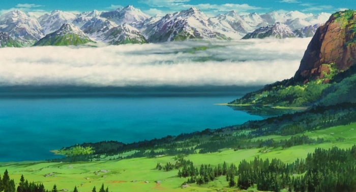

# LE LOGICIEL D’ANIMATION 2D DU STUDIO GHIBLI EST DÉSORMAIS OPEN SOURCE

On s’est toujours demandé comment sont réalisés les films d’animation. Bon pas tous, puisque certains sont chargés de les faire. Mais qui n’a jamais rêvé de pouvoir marcher sur les pas de Miyazaki lorsqu’il a réalisé les chefs d’œuvre du dessin animé (et du cinéma tout court) comme Mon voisin Totoro, Le Voyage de Chihiro ou Le Tombeau des Lucioles ?

Quoiqu’il en soit, maintenant, ce rêve est devenu réalité. En effet, Toonz, le logiciel d’animation 2D qu’utilisent notamment le Studio Ghibli ou encore Matt Groening (papa des Simpsons) pour sa série Futurama, est désormais en version libre et open source, et c’est génial.

## SERAS-TU LE PROCHAIN MIYAZAKI?

On peut remercier l’éditeur japonais Dwango (qui a racheté le logiciel) d’avoir inclus dans le deal de passer en open source, et ce dans l’objectif de « créer une plate-forme qui sera un laboratoire de recherches infinies pour l’industrie du film d’animation », pour devenir le « standard mondial pour l’animation 2D ».

La version gratuite, OpenToonz, est presque aussi complète que la version premium payante (dont la licence s’élevait à 10000$) quoiqu’elle contienne l’édition créée pour Ghibli. Elle offre la possibilité, entre autres, de transformer les dessins à la main (ou numériques) en graphiques vectoriels, puis d’en faire une séquence d’animation complète (même à partir d’un seul dessin, oui oui)

On peut retrouver sur la page Github d’OpenToonz le lien de téléchargement du logiciel, accompagné de Effects qui permet d’intégrer plusieurs effets visuels aux dessins, GTS qui est un outil de scanning développé par les Studios Ghibli spécialisé dans l’animation de l’image, et bien sûr le code-source du logiciel mis à disposition de toute personne désireuse de contribuer à OpenToonz ou de le modifier à sa guise.
