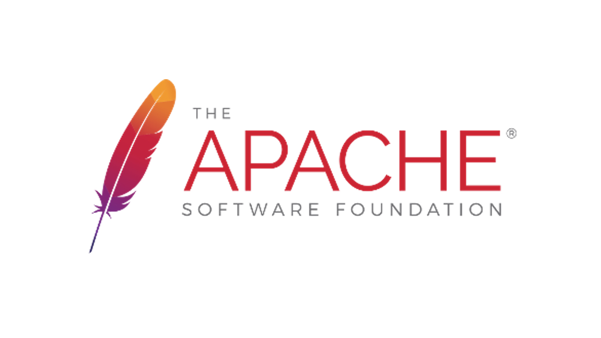

# Android Est-Il Vraiment Libre?

Android, le système d'exploitation pour mobile basé sur le noyau Linux et développé par Google est sans doute le système le plus répandu dans le monde. En effet il équipe actuellement plus de 80 % des smartphones vendus [1]. Coté licence, Google a publié le code source de diverses versions d'Android en grande partie en tant que logiciel libre [2] ce qui pourrait laisser croire que les smartphones tournant sous Android respectent vos libertés. On pourrait être tenté de penser qu'allier le savoir-faire de Google à une vérification minutieuse de la part d'une communauté importante de développeurs garantit non seulement une performance et des fonctionnalités de grande qualité mais aussi, et surtout, le respect des libertés fondamentales des utilisateurs.

La réalité n'est pas aussi flamboyante. Bien souvent, les fabricants de smartphones se permettent d'apporter des modifications à la version mise à la leur disposition par Google. Ces modifications, si elles portent surle noyau Linux, doivent être publiées pour pouvoir être en accord avec la version 2 de la **GPL (General Public Licence)**. Cependant, si les changements concernent les parties du code sous licence **Apache 2.0**, soit la majorité du code hormis le noyau, les fabricants ne sont pas forcément tenus de publier les modifications [2]. Cela peut être assez dangereux. Ainsi, en 2013, un utilisateur a découvert que son mobile transmettait secrètement des données à Motorola [3]. Des données personnelles telles que les mots de passes des comptes Facebook et Twitter des utilisateurs étaient transmises mettant gravement en danger leur vie privée. Autre point sensible, les pilotes logiciels. Ces derniers permettent de faire fonctionner les différents équipements de votre appareil. Malheureusement, ils sont souvent privateurs et peuvent, encore une fois, transmettre des données confidentielles à votre insu.

Enfin, bien que Google puisse donner l'impression de vouloir soutenir un système d'exploitation libre, la réalité du terrain montre le contraire. En effet, la commissaire européenne à la concurrence Margrethe Vestager a annoncé le 20 Avril 2016 avoir envoyé un acte d'accusation contre Android [4]. L'Europe accuse Google de concurrence déloyale et lui reproche principalement trois choses [5]. D'abord le fait d'obliger les fabricants de téléphones à installer Google Chrome par défaut sur leurs appareils en leur faisant signer un contrat d'exclusivité. Le second reproche concerne le fait que les fabricants ne soient pas libres d'installer le moteur de recherche de leur choix à partir du moment où ils souhaitent intégrer une application Google comme le Play Store. La dernière raison est liée au fait que Google ne permette pas le développement d'un Android alternatif car le géant américain empêche les constructeurs qui sont liés à lui d'acheter toute autre version que celle autorisée par la firme californienne. Margrethe Vestager n'y va pas par quatre chemins, elle affirme en
effet que : « Google a une stratégie très aboutie visant à asseoir et développer son irrévocable suprématie de la recherche Internet. ». Elle ajoute également : « Nous avons aussi des preuves que Google a abusé de sa position de leader pour imposer son système d'exploitation Android. ».

Toutes ces accusations sont confirmées par un document qui a été mis en ligne dernièrement et qui met en évidence les accords
existant entre Google et les constructeurs de terminaux mobiles [6]. En plus des obligations citées plus haut, l'accord signé entre Google et HTC, par exemple, montre que le fabricant Taiwanais a pour obligation d'embarquer et d'activer le système de
géolocalisation de Google. Autre point de l'accord, le constructeur a pour obligation de fournir au moins quatre prototypes de chaque nouveau smartphone qu'il compte lancer. Google se réserve le droit d’interdire son lancement s’il juge que l’appareil n’est pas « aux normes ».

Le monde de la téléphonie mobile est dominé par trois acteurs majeurs : Android, IOS et Windows phone. Sur le papier, Android a tout pour séduire : il équipe la majorité des terminaux du marché et c'est le seul système publié sous licence GPL2 et Apache 2.0. Malheureusement, en étudiant le système de plus près, on découvre qu'il pourrait, non seulement, être nuisible à la vie privée des utilisateurs mais aussi qu'il ne peut en aucun cas être qualifié de système d'exploitation libre.

### RÉFÉRENCES:

[1] HTTP://WWW.LEMONDE.FR/ECONOMIE/ARTICLE/2016/04/20/ABUS-DE-POSITION-DOMINANTE-CE-QUE-BRUXELLES-REPROCHE-A-GOOGLE_4905468_3234.HTML

[2] HTTP://WWW.GNU.ORG/PHILOSOPHY/ANDROID-AND-USERS-FREEDOM.FR.HTML

[3] HTTP://WWW.BENEATHTHEWAVES.NET/PROJECTS/MOTOROLA_IS_LISTENING.HTML

[4] HTTP://WWW.LEMONDE.FR/ECONOMIE/ARTICLE/2016/04/20/ABUS-DE-POSITION-DOMINANTECE-QUE-BRUXELLES-REPROCHE-A-GOOGLE_4905468_3234.HTML

[5] HTTP://WWW.CLUBIC.COM/PRO/TECHNOLOGIE-ET-POLITIQUE/ACTUALITE-803496-GOOGLEANDROID-OPEN-SOURCE-BON.HTML

[6] HTTP://WWW.CLUBIC.COM/OS-MOBILE/ANDROID/ACTUALITE-619002-ANDROID-DOCUMENT-LEVE-VOILE-ACCORDS-GOOGLE-OEM.HTML
