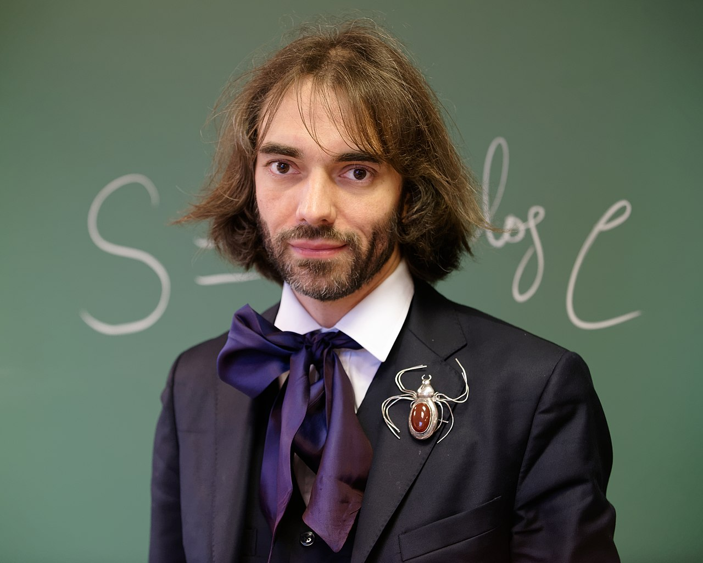

# Conférence de Cédri VILLANI à l’USTHB

Pour ceux qui ne le connaissent pas , Cédric Villani est un mathématicien français de renommée internationale et détenteu de la médaille Fields (l’équivalent d prix Nobel en mathématiques).

Cet illustre mathématicien nous a fait l’honneur de donner une série de conférences du 11 au 15 mars à Alger. Durant ses conférences, ouvertes au public, Cédric Villani a expliqué son amour des mathématiques.

En répondant à quelques questions de l’assistance, il a notamment déclaré que selon son point de vue, la recherche, et cela dans tous les domaines, se base sur l’échange et le partage d’idées. Il serait inconcevable selon lui que quelqu’un fasse une recherche sans transmettre des connaissances en même temps. Les avis des spectateurs allaient de la surprise à l’admiration. C’était un plaisir de le voir en vrai pour les professeurs et les étudiants de Mathématiques de l’USTHB.

“Il a l’air simple, agréable et raffiné pour un mathématicien” avoue une professeure d’Informatique, touten plaisantant sur son look. Bref, Villani a fait salle comble à chacune de ses conférences et a séduit le public par son naturel et son génie. Qui sait, peut-être que le prochain Villani est parmi nous.
