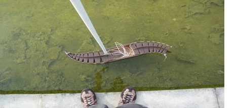

# Dépollution de l’océan par des approches Open Source

Dépolluer les océans est une tâche qui peut s’avérer être une utopie pour l’être humain, heureusement qu’aujourd’hui l’un des objectifs primordiaux de la recherche en informatique est de repousser les limites de ce qui est automatisable pour accomplir efficacement et sans effort les tâches répétitives, fastidieuses, portant sur des travaux longs et pénibles tout comme le nettoyage des océans. La réalisation d’un tel projet ne peut être que bénéfique pour la flore et la faune océanique ainsi que pour nous les humains.

Le jeune néerlandais Boyan Slat, étudiant en génie aérospatial a été le précurseur de cette démarche. À 19 ans, il conçoit une plateforme capable de débarrasser les océans de tonnes de déchets les recouvrant. Son fonctionnement est simple; la plateforme se charge d’aspirer les matières plastiques emportées par le courant et, une fois à l’intérieur, les déchets seront stockés et filtrés pour une exploitation ultérieure. Une méthode performante certes mais les enjeux économiques sont considérables, sauf quand l’Open Source se présente comme la clé d’un monde propre et décide de se mettre au service de l’environnement. L’équipe de recherche Open H2O, qui est une organisation à but non lucratif, est à l’origine du projet Protei qui se trouve être une technologie entièrement Open Source à faible coût, pour nettoyer les déversements de pétrole dans les océans et la collecte de débris de plastique dans ces derniers.

Développé par l’ingénieur franco-japonais César Harada, en collaboration avec la communauté Open H2O, Portei ce drone marin tire derrière lui une longue queue de 25 mètres absorbant près de 2 tonnes de pétrole et autres déchets divers. Les déplacements de sa queue sont réglables à distance au moyen d’une télécommande. Après plusieurs versions, Protei est désormais doté d’une voilure et sa coque se courbe au gré des vagues tel un poisson.

Un projet ouvert, ce qui a permis la réussite et le succès de cette technologie pour sauver le monde aquatique _« Quand on veut développer de la technologie au service de l’environnement, on veut être certain que celle-ci va servir le plus grand nombre au moindre coût possible »_, expliquait César Harada lors du neuvième OuiShare Talk à Paris.
