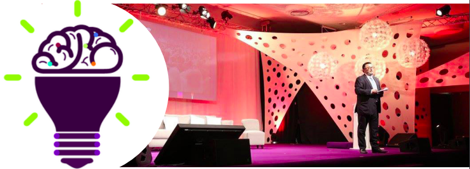

# Fikra15 : La réussite au bout des doigts

Fikra est une série de conférences à résonance citoyenne et médiatique qui se revendique la première du genre en Algérie, elle est organisée annuellement depuis trois ans par le groupe de conseil en communication Allégorie.

Cette troisième édition s’est déroulée les 14 et 15 Février à l’hôtel Aurassi; elle a accueilli plus de 1500 participants dont une grande partie était formée de jeunes étudiants ou entrepreneurs, et a été animée par les deux co-fondateurs de Fikra: Toufik LERARI et Marhoun ROUGAB.

Le thème choisi étant celui de la “Réussite”, plus de 30 speakers se sont succédés afin d’animer des talks en arabe, français ou anglais de 20 à 40 minutes et traitant de sujets autour de ce thème et donner de l’inspiration aux assistants
( un peu à l’image des TED talks) . Les intervenants venaients de domaines très variés: de L’entreprenariat à la philosophie en passant par la technologie ou encore l’art.

Parmi les speakers les plus marquants nous pouvons citer entre autres le philosophe tunisien Youssef SEDDIK, le diplomate Lakhdar BRAHIMI, les deux industriels Issad REBRAB et Laid BENAMOR ainsi que l’écrivain et militant pour les droits de l’enfant Mohamed Cherif ZERGUINE. Cependant, les participants ont regretté l’absence des ministres attendus qui ont tous annulé leurs intervention; la scène politique algérienne n’était donc pas représentée.

La jeunesse algérienne a été mise à l’honneur pendant l’événement: Fikra a été l’occasion de donner la parole à six jeunes talentueux qui ont réussi dans leurs projets respectifs tels que Nacim FILALI le fondateur de l’association SIDRA et la plus jeune romancière algérienne Ania MERIMECHE.

La parole a été donnée également aux lauréats du concours “Make your mark” qui devaient développer une application mobile dans l’une des cinq catégories: E-Learning, E-Health, Social Media, Games et E-Enterprise; le lauréat dans chaque catégorie a été récompensé par le président exécutif de Djezzy Vicenzo NESCI.

Un des gros points forts de Fikra était le “Networking” , elle proposait en effet un espace d’échange et de rencontre avec des acteurs influents de la société algérienne, les participants avaient ainsi la possibilité rare d’aborder de potentiels sponsors, partenaires, elle a également permis de réunir la communauté active de jeunes algériens. L’objectif de rassemblement et de connexion est donc atteint. En revanche, l’avis des participants était mitigé par rapport au thème et quelques talks jugés bâclés et pas assez inspirants par rapport à ceux des éditions précédentes , la rareté des invitations était également à regretter: seulement 50 invitations ont été proposées au public.

Néamoins, Fikra reste un événement majeur en Algérie qui permet de rassembler une grande communauté de jeunes algériens et d’acteurs économiques et sociaux, et l’initiative de rassemblement et d’inspiration est à saluer.
