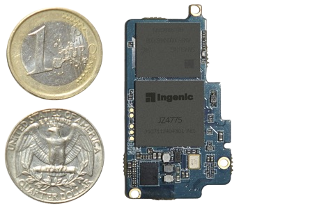

# Ingenic Newton : la plateforme Wearable

Les Wearable Electronics, comprenez par là l’électronique à porter sur soi, désignent tous les vêtements et accessoires comportant des éléments électroniques et informatiques avancés. Nous pouvons citer à titre d’exemple les lunettes intelligentes à l’instar des Google Glasses, ou la montre intelligente telle que la SmartWatch de Sony. Leur présence sur le marché informatique grimpe à une vitesse exponentielle, à tel point que BBC research prévoit que leur marché se chiffrera à hauteur de 30.2 milliards de Dollars à l’horizon 2018.

Ingenic Semiconductor, un important fournisseur de systèmes embarqués en Chine a décidé de tirer son épingle du jeu. La société, créée en 2005 et basée à Pékin, vient d’emboiter le pas à l’Edison d’Intel en sortant, en partenariat avec le britannique Imagination Technologies, le nano-ordinateur Ingenic Newton.

Ce dernier, de la taille d’une carte mémoire SD (21,6 mm par 38,4 mm) et destiné aux objets connectés, embarque le processeur XBurst JZ4775 à architecture MIPS, cadencé à 1 Ghz.

Le SoC est capable de faire tourner la dernière version d’Android (4.4 Kitkat) aussi bien que Linux 3.1, il contient également une puce graphique qui prend en charge la 2D ainsi que la lecture des vidéos en H.264 720p. Sa plateforme peut supporter jusqu’à 3 Go de mémoire vive DDR3. Il dispose aussi d’un circuit pour une connectivité sans fil complète (Wifi 802.11 a/b/g/n, Bluetooth 4.0, NFC et même FM), possède 256 Ko de cache de niveau L2, des capteurs et des ports d’extension (GPIO, UART, USB et I2C).La particularité de ce nano-ordinateur ? Sa faible consommation en énergie.

Ingenic Newton, ne consomme que 4mW en veille. Une smartwatch basée sur ce nano ordinateur peut bénéficier d’au moins 30 heures d’autonomie.
