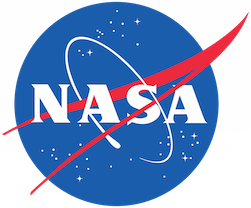

# La NASA adopte l’Open Source

Après mûre réflexion, la NASA (National Aeronautics and Space Administration) a décidé de diffuser les codes source de plus de 1000 de ses projets.

Des codes que l’agence gardait jalousement depuis les années 60, notamment celui du projet Apollo11 qui, rappelons-le, a permis à Neil Armstrong d’être le premier humain à marcher sur la lune, en 1969, devenant ainsi le plus grand accomplissement du programme spatial américain. Comme tous les projets « Open Source » dans le monde, cette initiative apportera probablement ses fruits à long terme.

 

De ce qui en ressort, beaucoup de choses ont retenu notre attention, nous citerons à titre d’exemple, la mise à la disposition des internautes, le 10 avril dernier, d’une base de données comprenant les ressources de plusieurs programmes tels que le simulateur de climat pour les systèmes de guidages des fusés, le système de cartographie du télescope « Hubble » ainsi que les services publiques tels CFD; qui est un logiciel utilitaire livré avec environ 30 bibliothèques de Fortran 90, BigView; qui traite le zoom d’images sur les ordinateurs de bureau sous Linux.

Un projet éminemment stratégique puisque il permet de booster la créativité et d’apporter une touche de vitalité dans ce domaine si bouillonnant.

A travers sa démarche, l’agence spatiale aura réduit la barrière d’accès aux innovateurs. Ceci conduira assurément à un changement radical et efficace de la mentalité actuelle car elle implique la communauté scientifique mondiale.
