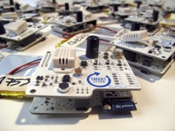
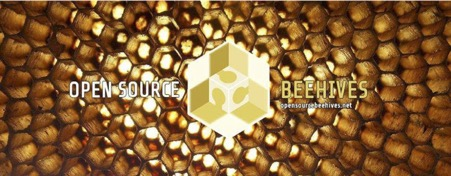

# Open Source Beehives

_“L’eau est une ressource vitale pour la survie de l’humanité” Un fait qu’on ne cesse de répéter au risque d’éclipser d’autres facteurs tout aussi indispensables à notre survie. Quelle serait votre réaction si je vous disais que les abeilles contribuent elles aussi à nous maintenir en vie ?_

La pollinisation, pratiquée essentiellement par les abeilles, est un élément clé dans la production agricole. Essayez d’imaginer maintenant ce qu’on ferait sans les abeilles... Ce serait évidemment très fâcheux si elles venaient à disparaitre. Eh bien, le risque est réel ! Toutefois, on peut grâce à l’Open Source éviter cette catastrophe, ou en tout cas en ralentir les effets...

> <strong>” Si l’abeille disparait, l’homme en a pour 4 ans”</strong>
>
> -- <cite>Albert Einstein</cite>

Conférence Ted de Juin 2013, Marla Spivak prend la parole. Des mots pleuvent, le ton est alarmiste... Un silence de mort s’abat sur la salle. Son discours soulignait d’abord l’importance que représentait la pollinisation pratiquée par les abeilles, leur incroyable vision de la vie en société, leur système de santé sophistiqué , le fait qu’elles prospèrent sur Terre depuis 50 millions d’années... pour ensuite déboucher sur un problème inquiétant, la disparition massive de ces mêmes abeilles depuis quelques années.

Depuis le milieu des années 1990, on a remarqué que les abeilles disparaissaient à une vitesse vertigineuse. Ce phénomène a été constaté en Asie, en Europe et en Amérique du Nord. Greenpeace attribue cela à l’agriculture irraisonnée et à l’utilisation des pesticides. D’autres mettent en cause la varroa, un parasite qui s’attaque aux ruchers, ou le redoutable frelon asiatique qui se nourrit des abeilles... La pollution est aussi pointée du doigt. Devant l’urgence de la situation, nous, simples citoyens du monde, devons agir.

L’organisation Open Source Beehives nous propose un moyen pour nous y prendre intelligemment en allant plus loin que la simple ruche en bois.

En alliant Open Source et Open Hardware, on peut créer une ruche intelligente. Cette dée, pour le moins originale, a longtemps germé au sein de la communauté espagnole d’autosuffisance Valldaura Il faut dire que les idées ne manquent pas au sein du centre de recherche et de formation qui abrite la communauté, ce dernier accueille chaque année des chercheurs qui explorent les voies de l’autonomie alimentaire.

Le prototype de ruche proposé est composé de capteurs contrôlés par un circuit Arduino. A partir des données que les capteurs fournissent à la plateforme en ligne SmartCitizen.me, on peut superviser la température de la ruche, évaluer le nombre de ses occupants, s’enquérir de la santé des abeilles, comparer l’état de notre ruche avec celui d’autres ruches voisines et obtenir un tas d’autres informations.

Selon Copley Smith (manager au sein de l’organisation et diffuseur de la technologie) l’objectif d’Open Source Beehives est double; En plus de constituer un barrage à l’effondrement massif des colonies d’abeilles, le projet s’installe dans la même lignée que HoneyBeeNet de la NASA, qui vise à surveiller l’évolution des colonies d’abeilles aux États-Unis d’Amérique et d’étudier l’impact des changements climatiques sur la vie des abeilles, _« Notre objectif est de monter un réseau maillé de colonies intelligentes, qui crée des données ouvertes, partagées pour étudier le syndrome d’effondrement et ses causes »_ a-t-il déclaré.

Tous les plans de la réalisation de deux modèles de ruches sont disponibles dans le site Sketchfab. _« La ruche peut être réalisée à partir d’une simple planche de contre-plaqué et s’assemble en quelques minutes, sans vis ni colle »_, déclare Copley Smith.

L’organisation Open Source Beehives précise que ses ruches sont réalisables en DIY seul ou en Fab Lab, cela signifie que tout le monde peut “et doit donc” apporter sa contribution... Il en va de l’avenir de l’humanité !

Pour suivre l’évolution d’OpenBeehives nous vous invitons à suivre leur actualité sur Twitter (en followant leur compte @OSBeehives), sur Facebook (en vous abonnant à la page _“Open Source Beehives”_) et à consulter régulièrement leur site web opensourcebeehives.net.

