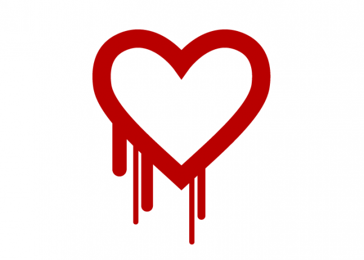

# Code open source: Vigilance

Dans un monde parfait, le code open source est plus fiable car il peut être visionné, vérifié et modifié par plusieurs personnes. La réalité est assez différente : beaucoup de développeurs font une confiance aveugle aux codes récupérés depuis les librairies open source car ils sont, selon eux, vérifiés par la “communauté”. Néanmoins, en se basant sur cette logique, personne ne vérifierait la qualité du code et les utilisateurs se retrouvraient avec, au mieux, un code non fonctionnel et au pire un code rempli de failles pouvant avoir des répercussions désastreuses. Jake KOUNS, chief information security officer chez Risk Based Security – une entreprise spécialisée dans la détection de vulnérabilités – affirme que “ les développeurs et entreprises utilisant du code open source tiers n’allouent pas assez de ressources pour tester les code qu’ils utilisent” il ajoute également que “tout le monde pense, à tort ou à raison, qu’il y aura toujours quelqu’un pour trouver les failles et les corriger”.

Heartbleed, Shellshock et POODLE sont autant d’exemples des effets dévastateurs que peut avoir l’utilisation de codes tiers non testés.

Les failles que nous venons de citer n’étaient d’ailleurs pas des cas isolés. Ainsi, des vulnérabilités moins médiatisées ont été découvertes dans des librairies telles que LibTIFF ou OpenJPEG et qui sont utilisées par des milliers de développeurs. Les failles existant dans les programmes open source découlent de plusieurs facteurs parmi lesquels l’utilisation de code dépassé qui ne répond pas aux exigences de sécurité actuelles ou le manque de support permettant au code d’évoluer.

Heureusement, ces failles n’ont pas eu qu’un effet nocif. En effet, elles ont attiré l’attention des développeurs sur l’importance des tests avant l’implémentation de codes tiers. De plus, elle ont permis de « patcher » plusieurs failles qui ont été découvertes depuis.
