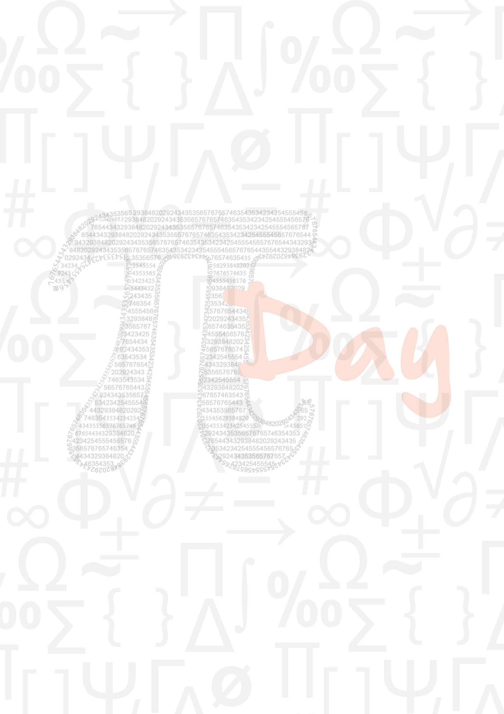
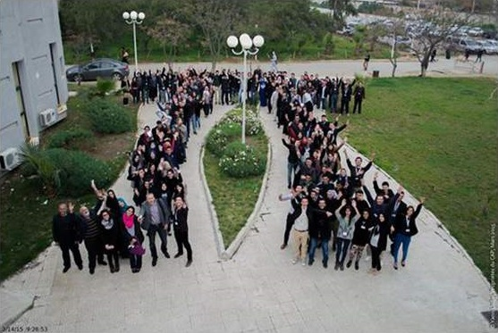
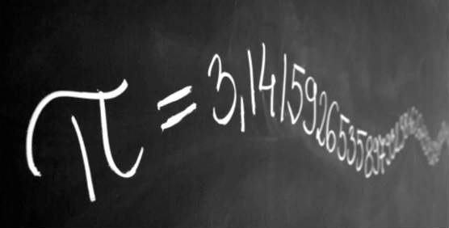

# Le Pi Day

Il fait froid et il risque de pleuvoir. Le ciel laiteux, caché derrière des
strates de cumulus, impose à la ville d’Alger son regard triste et morose.
Nonobtant le pessimisme révoltant de la météo, des têtes éclairées par la beauté 
de l’instant ont décidé de défier le ciel. Ces têtes-là surchauffent de joie. 
Leur chaleur dépasse les 100° Fahrenheit... La raison ? Ils s’apprêtent à vivre
la seconde la plus géniale de l’année; Une seconde qui célèbre un nombre. Un
nombre qui, depart son importance, intrigue et fascine depuis toujours la
communauté scientifique. Un nombre à virgule flottante, un trois virgule quelque
chose, enfin bref, vous l’aurez compris, ou pas, il s’agit du nombre π.
Nous tâcherons, tout au long de cet article, de vous faire revivre les instants
les plus importants de cette journée.  

Le nombre π est célébré dans les quatre coins du monde, chaque année au même 
jour, le 14 Mars. La plupart du temps, cette occasion offre une opportunité
à la communauté scientifique pour parler du nombre en lui-même et de réfléchir, 
encore une fois plus profondément, sur la beauté des mathématiques; leur
importance n’étant plus à prouver.  

À l'U.S.T.H.B, le club Open Minds a décidé en collaboration avec le club CAP,
**C**lub d'**A**ctivité **P**olyvalente, de l'école Polytechnique d'Alger,
de célébrer le Pi Day comme il se doit. Pour ce faire, une équipe, constituée
d'une poignée d'étudiants provenant des deux clubs, a **été formée**.  

Le Cyber Espace a été choisi comme le leu idéal pour abriter l'événement.
Ce dernier comprendra une série de conférences qui seront jalonnées surtout par
l'intervention de professeurs de mathématiques de l'université de Bab Ezzouar
et de l'école Polytechnique. Au cours de cette journée, des stands ont été mois
à la disposition de certains membres de l'équipe organisatrice pour inviter les 
participants à s'essayer à divers jeux de réflexion, à l'instar du Rubik's Cube
et du Tangram.

### Petit tour d'horizon des moments forts de cette journée

Nous préciserons que la conférence a été anime toute la journée par un membre de
club Open Minds, GUERROUMI Nassim étudiant en 1ère année Master Systèmes
Informatiques intelligents à l'USTHB, et BOUKLI Souad, une membre du Club
d'Activité Polyvalente et élève-ingénieur en première année Génie Industriel à
l'ENP.  

**8h30** Le Pi day a démarré avec la présentation des clubs organisateurs de
l'événement: Open Minds Club de l'USTHB, présenté par son vice-président
MELAINE Samy (étudiant en 1ère année Master Systèmes Informatiques intelligents),
et le Club d'Activité Polyvalente de l'ENP, présenté par son président BRIEDJ 
Fawzi (élève-ingénieur en 2ème année Automatique à l'École Nationale
Polytechnique d'Alger).  

	

**À 9h 26m 53sec** est arrivé le moment de vérité. Le moment qu'un bon nombre de
personnes attendait depuis des mois voire des années. La magie qui se dégage de
cette 53ème seconde, sera peut être moins éclatante l'année prochaine.
Cette seconde ensorcelante n'arrive qu'une fois tous les siècles nous dit-on.
À cet instant, il a été décidé d'immortaliser cette seconde par la formation
humaine d'un Pi géant, dont vous pourrez largement apprécier la beauté en
contemplant l'image ci-dessus.  

**9h45** Le Pr. KHELLADI Abdelkader ouvre le bal avec une conférence intitulée
"*L'histoire de Pi*".  

Le professeur KHELLADI Abdelkade un enseignant à la faculté de mathématiques
de l'USTHB et l'ancien directeur du Centre de Recherche sur l'Information
Scientifique et Technique (CERIST). En commençant par saluer l'initiative de
l'équipe organisatrice, il précise que le nombre π est célébré depuis 25 ans par
des dizaines de pays. "*Né de parents inconnus et séparés*",
"*relié àla quadrature de cercle*", l'on a essayé de cerner sa valeur à maintes
reprises, au cours de l'histoire, et parmi la longue liste des peuples qui s'y
sont intéressées de plus prés, nous comptons les égyptiens, les indiens, les
babyloniens, les chinois... Ces derniers en ont d'ailleurs fait une appropriation
très satisfaisante.  

Archimède a donné une définition du nombre, et a inventé une méthode pour le
calcul de la circonférence d'un cercle. Lambert a dit du nombre qu'il est
irrational. Newton et Leibniz l'ont utilisé dans leurs travaux. Al Kashi grâce à
des calculs est arrivé à calculer π avec une précision de 14 décimales.  

Toutefois, le nombre π est transcendant: Cela veut dire qu'on ne pourra jamais
en citer toutes les décimales.

### Aux environs de 10h30 Présentation du Rubik's Cube par HIBA Ilyes

HIBA Ilyes est un étudiant en 3ème License Microbiologie fondamentale et
appliquée. Il a entamé sa conférence en parlant de l'histoire du Rubik's cube.
Le jeu a été inventé le 19 Mai 1974 par l'architecte Hongrois et professeur de
design, Ernö Rubik. L'on raconte que ce dernier "*a passé plus d'un mois pour*
*résoudre le jeu en lui même*". Ilyes a poursuibi sa conférence en citant
quelques méthodes utilisées pour le résoudre telles que: la méthode couche par
couche, la méthode sandwich et la méthode de Lars Petrus.

### 10h45 "Méthodes insolites de calcul de Pi" par M. ZEKIRI Abdelmoumene

M. ZEKIRI Abdelmoumene est un enseignant à la faculté des mathématiques de
l'USTHB. A travers sa conférence, il veut citer ceux qui, à travers les âges,
ont approximé au mieux la valeur de π.  

	

Le but de sa conférence est aussi de parler des différentes méthodes de calcul
des décimales de π. A cet égard, il a cité la méthode des polygones, les
intégrales de Wallis (Le produit de Wallis), les formules analytiques, la
méthode de Newton, l'aiguille de Buffon, la contribution des frères Borwein...etc.  

Par ailleurs, en ce qui concerne le calcul des décimales de π, il a précisé que
le dernier record, atteint le 8/10/2014, a révélé jusqu’à [13300 milliards de
décimales de π][1].  

**Aux alentours de 11h20** Après le défi lancé par l'animateur GUERROUMI Nassim,
la polytechnicienne BENAISSA Rihab saisit un feutre et décide de mettre à nu pas
moins de 152 décimales du nombre π sur un tableau!

### À 11h30 M. AIB Mabrouk présente la théorie des jeux

["*AIB Mabrouk est Docteur-Ingénieur diplôme de l'ENP. il est directeur Algérie*
*de SAP (Leader mondiale des solutions logicielles pour entreprise) et chargé*
*de cours à l'ENP. Il enseigne la fiabilité et les statistiques au sein du*
*département GI.*"][2]  

M. AIB débuté sa conférence en parlant de [l'histoire de la théorie des jeux][3].
Ses premiers balbutienments remontent aux débuts du 19ème siècle avec 
"*l'analyse du duopole d'Antoine Augustin Cournot publiée en 1938*", mais ce
n'est qu'à partir de l'ouvrage de John von Neumann et Oscar Morgenstern (1944)
que la théorie des jeux a été présentée de manière structurée.  

En 1994, John Nash, Reinhard Selten et John Harsanyi ont été récompensés avec
le Prix Nobel de l'économie pour leurs travaux dans ce domaine.

### 12h20 vient le tour de BETROUNI Khalil de présenter un jeu: le Tangram

BETROUNI Khalil est un étudiant en 1ère année Master SII (Systèmes Informatiques
Intelligents).  

[Le Tangram][4] est un jeu qui, selon la légende, a vu le jour suite à un
accident: UN empereur chinois fit tomber un carreau de faïence qui se brisa en
7 morceaux.  

Malheureux d'avoir perdu un object d'aussi grande valeur, il a passé des nuits
et des jours à essayer de le recoller. En s'attelant à la tâche, il n'est
apparemment pas venu à bout de son entreprise, ou du moins pas tout de suite,
mais il a réussi à créer plusieurs formes différentes à partir des morceaux du
carreau. brisé. De ses petits chefs-oeuvres éphémères, est née l'idée du Tangram.  

Pour détendre l'atmosphère, Khalil a présenté cette anecdote de manière plus
drôle en usant et en abusant des mèmes dans ses diaporamas. Il a toutefois 
remplacé le carreau de faïence par un vase et a inclus dans l'histoire la 
présence d'un chat, qui est cette fois à l'origine du vase cassé. Ce dernier
se moquait tantôt de la tristesse de son maitre, et tantôt s'étonnait de 
recoller infructueusement le vase.  

### À 12h30 le Pr. YAHI Mustapha donne une conférence sur l'omniprésence mathématique dans le monde qui nous entoure

["*Le professeur YAHI Mustapha est enseignant de statistiques et chef du*
*département de Probabilités et Statistiques à la faculté de Mathématiques de*
*l'USTHB.*"][5]

En attendant de pourvoir obtenir une projection correcte de ses diaporamas, il a
commencé par remercier longuement l'initiative des clubs organisateurs.  

Le but de sa conférence est de "*parler tout simplement des mathématiques*", 
"*dire à quoi ça sert*" en rappelant qu'à la naissance "*un bébé sait compter*
*en binaire*"!  

Pour faciliter la mémorisation de la formule qui permet de calculer la
circonférence d'un cercle, il a parlé de l'énigme du chasseur avec sa pipe et 
une panthère. ([A retrouver en visitant la page suivante][6])  

"*Pourquoi oublie-t-on les maths ?*" : S'est-il interrogé. Pourquoi est-on si
prompt à parler de l'illettrisme sans presque jamais évoquer les problèmes liés
à l'innumérisme.  

La communication via les mathématiques est apparue avant l'usage des lettres, en
attestent les tablettes d'argile sumériennes où ne figuraient que des formes 
répétées. un certain nombre de fois pour représenter la quantité.  

M. YAHI a raconté ensuite l'histoire de Jason Padgett, un américain qui après 
avoir été passé à tabac à la sortie d'un pub en 2002, s'en est miraculeusement 
sorti avec une commotion cérébrale; Un traumatisme qui lui a complètement 
transformé sa manière de d'apercevoir le monde. Atteint du syndrome du savant 
acquis, il voit le monde sous l'image de formes géométriques. Il a un peu 
découvert une autre facette du monde; Tout cela pour dire que les mathématiques 
sont partout.  

Pour terminer, il s'est longuement étalé sur la place qu'occupent et
qu'occupaient les mathématiques en Algérie: Leonard de Pise, dont le père 
travaillait en tant que marchand à Bougie (La ville actuelle de Bejaïa), était 
impressionné par l'érudition dans laquelle baignait la ville. En retournant en 
Europe, il emmena avec lui les chiffres arabes dont il a parlé dans son célèbre 
ouvrage, le Liber Abaci. A sa mort, Leonard de Pise prit le nom de Fibonacci.  

Maurice Audin, membre du Parti communiste algérien et militant de l'indépendance
de l'Algérie, était un mathématicien. Il devait présenter sa thèse le 2 Décembre
1957, mais il a disparu avant cela. Même Christian Gourcuff, l'actuel 
sélectionneur de l'équipe algérienne, a été surpris par la présence de football,
était un ancien professeur de mathématique et théoricien du football.

### Aux alentours de 13h15, YAHI Lina présente le jeu Mastermind

YAHI Lina est étudiante en 1ère année Master IL (Ingénierie Logicielle).  

Elle a présenté le jeu Mastermind, a parlé de la manière d'y jouer et a invité 
tous ceux qui le veulent à aller le découvrir dans le stand des jeux.

### Reprise aux alentours de 14 heures avec la pause musicale de BRIEDJ Fawzi

Que dire sinon qu'il ne fallait absolument pas rater ce moment là. **9:26:53** 
était sûrement un passage obligé pour avoir le droit de dire à vos petits 
enfants: "*Oui, j'y étais !*". Mais 14 heures et des poussières (Mais bon sang, 
il ne s'agissait pas de n'importe quelles poussières !) était le moment magique 
qui vous permettra d'ici dix, vingt ou trente ans, voire plus, de discourir plus
longuement sur le "*Oui, j'y étais !*".  

Fawzi jouera deux morceaux: Le premier, de sa propre composition, est né de 
l'idée d'associer aux décimales du nombre π, des notes musicales. Il a aussi 
apporté au tout des modifications pour rendre le son mélodieux et agréable à 
l'ouïe. Il a nommé son oeuvre le "*Son do Pi*".  

La seconde mélodie, intitulée la "*Comptine d'un autre été*" tirée de la BO du 
film "*Le Fabuleux destin d'Amélie Poulin*", a été tellement magnifiquement jouée
qu'elle a plongé la salle dans un silence monastique. En effet, c'est elle qui 
traduit au mieux l'état d'esprit des participants cette journée là. Je n'ai pu 
personnellement me retenir de verser une petite larmichette à la fin... 
Bravo Fawzi !

### 14h30, Conférence de M. MEGHLAOUI Sofiane

"*Financier de formation, Marketer de profession, et Matheux/Nerd de passion.*"  

MEGHLAOUI Sofiane a travaillé comme consultant en management, a été administrateur
d'un centre d'entrepreneurship et travaille aujourd’hui comme marketer dans 
les produits et services chez un important opérateur de téléphonie mobile en 
Algérie.  

Il a parlé dans sa conférence de la relation qu'il a eu avec les mathématiques 
au cours de sa vie, cité tous les pays où il a été depuis son enfance: 
Madagascar, Éthiopie, République Démocratique du Congo, Suisse, France, Brésil, 
Canada (Québec)... Au fil de ses voyages et à chaque étape de sa vie, il a vu 
son intérêt s'accroître. pour les mathématiques.  

"*Il faut bien lire les énoncées*" Telle est, selon lui, la recette miracle pour
résoudre n'importe quel exercice en mathématiques.  

Il a dédié la seconde partie de sa conférence à un sujet d'actualité;
les Big Data, ou mégadonnées, dont la taille, à l'échelle mondiale, a atteint 
plus de 2.7 Zeta octets en 2012.

### 15h20, conférence du Pr. BEBBOUCHI Rachid

["Pr. Rachid BEBBOUCHI est un docteur en équations différentielles à l'Université
de Strasbourg, il enseigne à l'USTHB et est également membre de l'American
Mathematical Society ainsi que de la société Mathématique de France."][7]  

M. BEBBOUCHI a parlé des mathématiques en Algérie, dont le niveau est peu
reluisant. Ceux-ci doivent impérativement retrouver leurs lettres de noblesse.  

Il profitera aussi de l'événement pour célébrer à sa manière la journée mondiale
de la femme. A cet égard, il a consacré une grande partie de sa conférence pour 
parler de la contribution de la gente féminine à l'essor des mathématiques, et 
cela depuis l'antiquité.  

Il a terminé par encourager les gens, et sur tout les jeunes à s'intéresser aux 
mathématiques en précisant que 95% des diplômés des filières mathématiques dans 
le monde arrivent à trouver un emploi.

[1]: https://fr.wikipedia.org/wiki/Pi#.C3.88re_informatique
[2]: https://fbcdn-sphotos-f-a.akamaihd.net/hotos-ak-xfp1/t31.0-8/s960x960/10818354_812009628880587_4326780779861311558_o.jpg
[3]: https://fr.wikipedia.org/wiki/Th%C3%A9orie_des_jeux#Histoire
[4]: https://www.jeusetetmaths.com/article-le-puzzle-le-tangram-des-maths-amusantes-102967865.html
[5]: https://scontent-bru.xx.fbcdn.net/hphotos-xpf1/t31.0-8/s960x960/11001530_811053205642896_7950564767672131171_o.jpg
[6]: https://www.enigme-facile.fr/le-chasseur-dans-la-savane-313
[7]: https://fbcdn-sphotos-h-a.akamaihd.net/hphotos-ak-xpa1/t31.0-8/s960x960/11046603_811000508981499_7092069301424718242_o.jpg