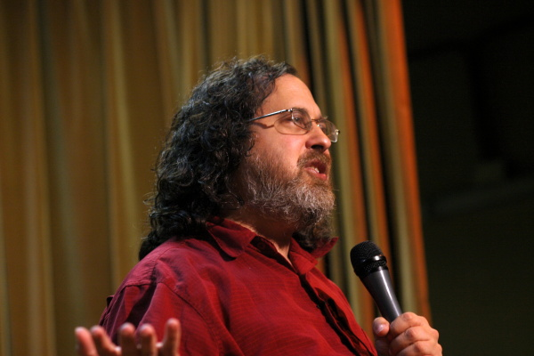
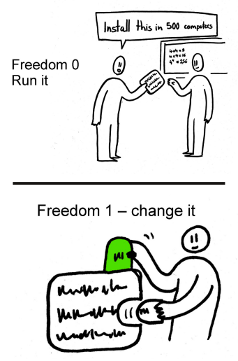
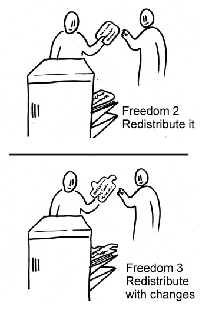

# Conférence: Richard Stallman à Alger

Si vous avez suivi, ces jours-ci, l’actualité algérienne sur les nouvelles technologies (de manière générale) ou sur le logiciel libre et l’Open Source (en particulier), vous n’êtes surement pas passés à coté de cette information: Richard Stallman nous rend visite pour réaliser une série de conférences sur la philosophie du logiciel libre.

Parmi les conférences que RMS a animées, la rédaction du magazine a tenu à assister à l'une d'entre elles : Plus précisément à celle qui s'est déroulée au Palais de la Culture, à Alger, et dont l'intitulé est "Free Software and Your Freedom". Avant de relater l'essentiel de ce qui a été dit lors de cette conférence, nous allons brièvement présenter Richard Stallman, citer une partie de sa contribution dans le monde du logiciel libre et dresser les quatre libertés dont jouissent les utilisateurs d'un logiciel libre. Richard Matthew Stallman, ou rms (en miniscules), est un programmeur et un militant du logiciel libre. Il est à l'origine du mouvement du logiciel Libre. En 1983, il lance le projet GNU et la licence publique générale GNU (GPL).

Il a développé beaucoup de logiciels, parmi lesquelles, nous citerons l’éditeur de texte GNU Emacs, le compilateur C de GNU, le débugger GNU et le moteur de production GNU Make écrit en collaboration avec Roland McGrath. (Informations tirées de [1]) La philosophie du logiciel libre, dont Richard Stallman est un des fervents défenseurs, veut que les utilisateurs soient libres d'exécuter, de copier, de distribuer, d'étudier, de modifier et d'améliorer les logiciels. (Présentation tirée de [2])

Un utilisateur d’un logiciel libre bénéficie des quatre libertés essentielles suivantes : (L'énoncé des quatre libertés a été retranscrit à partir de [2])

- La liberté d'exécuter le programme comme il le souhaite, pour n'importe quel usage (liberté 0) ;

- La liberté d'étudier le fonctionnement du programme et de l'adapter à ses besoins (liberté 1) – une condition préalable est d'accéder au code source ;

- La liberté d'en redistribuer des copies pour aider les autres (liberté 2) ;

- La liberté d'améliorer le programme et de rendre publiques ses améliorations pour que toute la communauté en bénéficie (liberté 3) – une condition préalable est d'accéder au code source.[2]

Dans sa conférence du 7 février dernier, après s’être lancé dans des diatribes à l’égard des logiciels privateurs, Richard Stallman a rappelé les quarte libertés que chaque logiciel doit respecter pour être admis au giron des logiciels libres. Il a parlé, ensuite, de sa contribution dans la création du système d’exploitation GNU Linux, et où Linus Torvalds a participé en mettant, en open source, le code source du noyau Linux. Et enfin, il a invité les participants à travailler avec des systèmes complètement libres et à démocratiser les idées de la philosophie du logiciel libre en les faisant connaitre à travers l’école et l’université. Pour en apprendre davantage sur la philosophie défendue par Richard Stallman, nous vous invitons à consulter ce site web: https://gnu.org/philosophy/

Si vous êtes à la recherche d’un système d’exploitation libre, ce lien vous sera d’une grande utilité: https://gnu.org/distros/

Vous pouvez télécharger les slides de cette conférence sur le lien : https://static.fsf.org/nosvn/RMS_Intro_to_FS_TEDx_

### Références:

[1] http://fr.wikipedia.org/wiki/Richard_Stallman

[2] https://www.gnu.org/philosophy/free-sw.html
