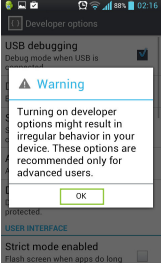
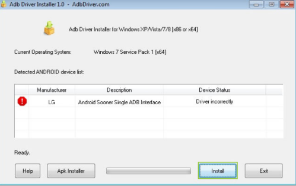
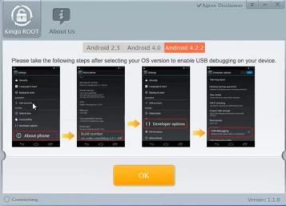

# Comment Rooter un appareil Android

## Tout d’abord pourquoi rooter son appareil

Il y a bien des raisons pour le faire, qui sont principalementliées à des failles de sécurité, nous en      citerons les suivantes :
Obtenir les droits d’accès à des fichiers cachés et/ou pouvoir les modifier ou les supprimer.
• Pouvoir supprimer les applications système (préinstallées) et libérer de la mémoire.

• Savoir quelle application fait quoi à quel instant et ce grâce à SuperSu de Chainfire (ne marche que si l’appareil est
rooté), ainsi que plein d’autres applis...

• Pouvoir modifier sa version Android en installant des Roms Customisées (des versions d’OS Android non-officielles).

• Pouvoir installer des CutomRecoveries (des outils de sauvegardes et de restauration).

## Remarque

 Ce petit tuto n’est pas destiné aux amoureux de développement et des consoles de commandes mais plutôt simple & rapide est accessible au grand public ayant au moins une fois été en contact avec Android OS, ça marche sur presque* tous les appareils (Smartphones, Tablets, Phablets...)tournant sous Android (de la v2.3 à la v4.2.2) la réussite sous KitKat (v4.4/4.4.1) reste inconnue. Cependant, il faut que vous soyez connectés à Internet pendant tout le processus pour réussir l’opération.

## Étape 1

Activer **l’Android Debugging Mode** sur votre appareil, en allant dans **paramètres (Settings)** et en choisissant **Options de développement (Developpers Options)** que vous trouverez sous
l’onglet **Système** (System), si un avertissement apparaît cliquez **ok**, enfin cochez la case **Débogage    USB (USB Debugging)**.

        

## Étape 2

Lancez ADB installer et connectez votre appareil à votre pc en utilisant le câble USB . Attendez un petit instant pour que l’appareil soit dé-
tecté (son nom devrait apparaitre sur la fenêtre avec un petit point d’exclamation rouge).

    

## Étape 3

Cliquez sur **Install** et attendez l’installation (maintenant il devrait y avoir un tick vert à la place du point d’exclamation) cela signifie que les pilotes sont à présent installés.

## Étape 4

Cliquez sur exit, installer & lancez la Kingoapp (Kingo Android ROOT)
et Cliquez sur Ok lors de l’écran de démarrage vous expliquant comment activer le Debugging Mode.

## Étape 5

Attendez la connexion et la détection de votre appareil, il est possible que ça se connecte et se déconnecte juste après (en plusieurs fois) et que ça prenne un peu de temps (Il n’y a pas de problèmes c’est normal).

## Étape 6

Maintenant que votre appareil est connecté définitivement et que son nom apparaît, cliquez sur ROOT (En Rouge !) en bas. Mangez votre banane en attendant  :relaxed:
la fin de l’opération.Quand c’est fini vous verrez que votre appareil s’éteint et redémarre, ne craignez rien c’est normal.

## Étape 7

Après le redémarrage, attendez la reconnexion sur le logiciel Kingo, et vous devriez voir la page du RootStatus comme étant fait !

## Étape 8

Vous pouvez grâce aux deux gros boutons d’en bas soit re-rooter votre appareil soit enlever complètement le root

---
Voilà vous êtes maintenant un Super Utilisateur, remarquez que sans la banane ça n’aurait probablement pas marché ! :stuck_out_tongue_winking_eye:

Profitez bien de votre appareil à présent rooté, et pour ce qui est des roms et recoveries customisées, allez consulter les tonnes de forums dédiés à Android (XDA developpers, tutoriels-android...) mais allezy mollo quand même ne faites pas quelque chose d’irréversible sans avoir créé de Backup et pris conscience des risques avant !
