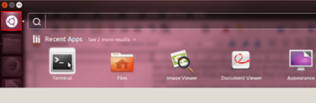

# Activer et Désactiver le compte Root dans Ubuntu

Le Root est le compte qui a tous les privilèges sur le système Ubuntu. Parfois, il est déconseillé d'avoir toutes les permissions sur une session.
En effet, il existe plusieurs commandes système qui peuvent changer le comportement de celui-ci si elles ne sont pas bien utilisées,
comme elles peuvent entraîner des dégâts critiques ou une perte de données irréversible .
Les développeurs d'Ubuntu, pour des raisons de sécurité, ont désactivé le compte Root par défaut dans toutes les installations Ubuntu.
Mais ça ne veut pas dire que ce compte n'existe pas ou qu'il n'est pas accessible. Il faut juste le réactiver. C'est ce qu'on va faire dans ce tutoriel .

## Pour Activer le compte Root

Pour cela, nous aurons besoin d'un seul compte Ubuntu, celui que nous avons créé lors de l'installation du système. Par
défaut ce compte a la permission d'exécuter la commande **sudo ( Super User Do )**.
Pour exécuter /les commandes , on utilise le terminal . Cliquezsur le **Dash Home** et cherchez l'icône du terminal, vous
pouvez le faire plus rapidement en appuyant **ALT+CTRL+T**

Pour créer un mot de passe pour le compte Root , tapez la commande suivante :  `sudo passwd root`  

## Faites attention

Lorsque la commende sudo demande un mot de passe , il faut faire entrer le mot de passe de compte COURANT et si elle demande un nouveau mot de passe pour UNIX , vous tapez le mot de passe de root.

### Maintenant le compte root est activé

On besoin maintenant d'activer le bouton LOGIN .exécutez la comende suivante :

 `sudo sh -c 'echo "greeter-show-ma-nual-login=true" >> /etc/lightd-m/lightdm.conf'`

Vous remarquez que le nom de l'utilisateur affiché dans le barre de tache est **Guest**.

Vous pouvez confirmer qu'il s'agit d'un compte Root en ouvrant le terminal et en tapant : **who am i**

Lorsque vous êtes connectés à un compte Root , plusieurs services comme Google Chorme ne vont pas fonctionner .Veuillez cherche un autre tutoriel
sur comment les activer pour le compte Root .

## Désactiver le compte Root

 Si vous voulez maintenant désactiver le compte root , vous devez d’abord vous connecter au compte avec lequel vous avez activé le
compte Root, puis ouvrir le terminal et taper la commande

 `sudo passwd -dl root`

Toutefois, Il est rarement nécessaire d'activer le compte Root. Presque tout ce dont vous avez besoin est faisable par la commande
sudo ou la commande `gksudo`
